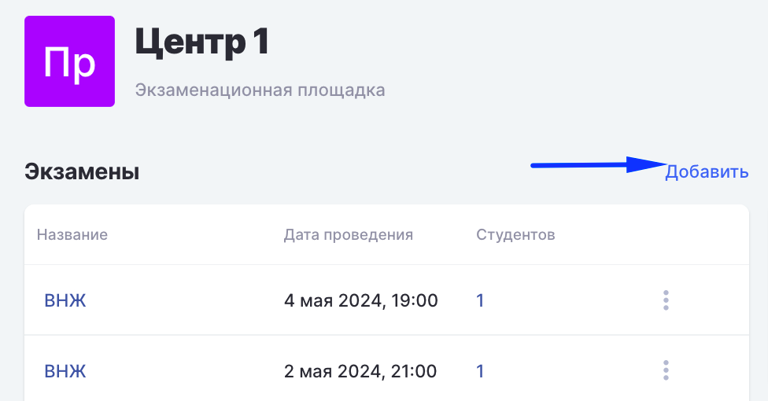
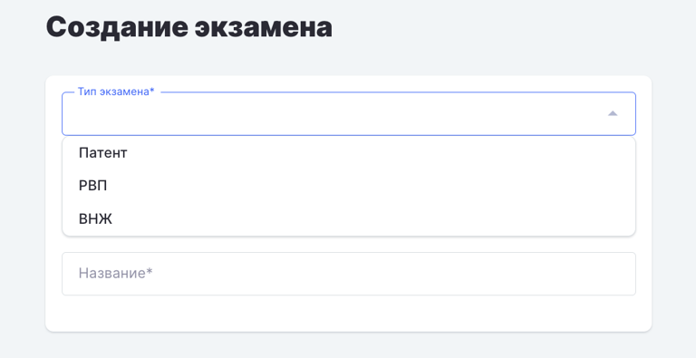
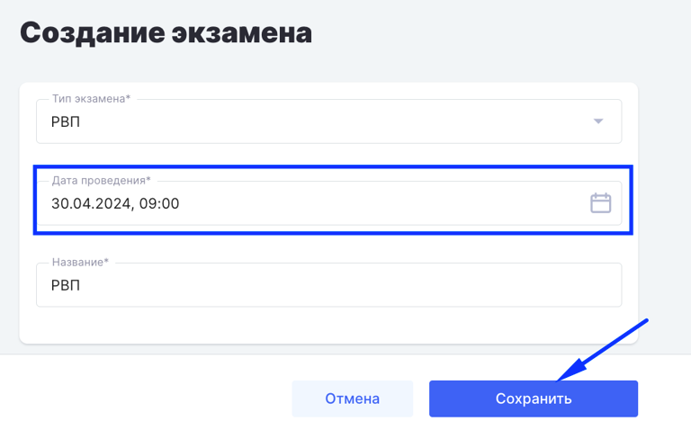

**Экзамен добавляет Администратор  экзаменационной площадки**\
На странице Площадки в соответствии с расписанием необходимо:

1. Добавить Экзамен

   {width=768px height=401px}

2. Выбрать тип экзамена

   {width=768px height=395px}

3. Установить дату и время проведения, сохранить.

   {width=768px height=488px}

4. Для ролей “администратор” и “Сотрудник экзаменационной площадки” реализован механизм[ смены даты экзамена](./../voprosy/flow-kak-pomenyat-uroven-datu-ekzamena) (потока).

:::info 

Можно изменить название экзамена на другое (удобное и понятное для площадки), по умолчанию экзамен называется так же, как и его уровень (Патент, РВП, ВНЖ)

:::

:::info 

В системе существует запрет на удаление экзаменационных материалов по следующей логике:

1. Запрещено удаление шаблона программы и связанного с этим шаблоном материалов (шаблон дисциплины -> шаблон активности -> тест) всем пользователям.

2. При попытке удаления какого-либо материала из этой связки отобразится предупреждение: "Невозможно удалить материал в связи с его использованием на экзамене для иностранных граждан".

:::