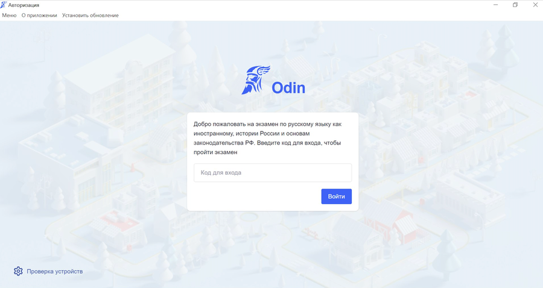
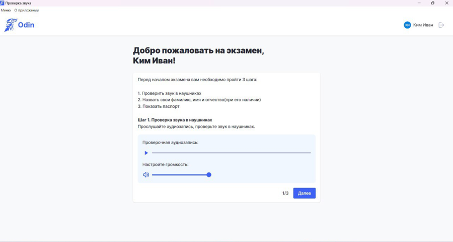
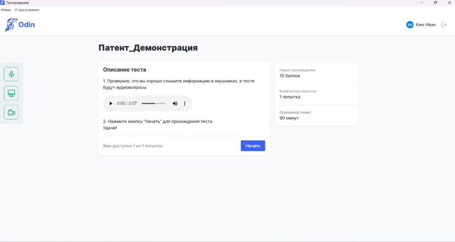
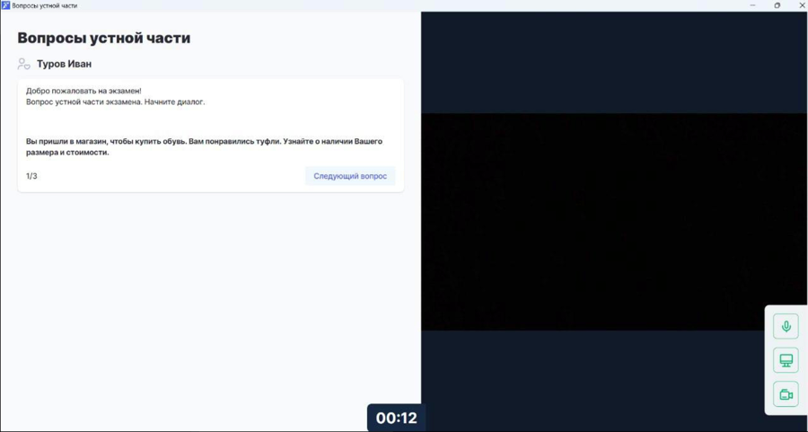

Тестирование проводится для всех уровней экзамена: Патент/Разрешение на работу, РВП, ВНЖ. Устная часть только для экзаменов РВП и ВНЖ

:::info 

Во время инструктажа сдающий получает [код](https://informa.gitbook.io/immigraciya/centr-testirovaniya-v-odin/skachat-kody-dlya-vkhoda-sdayushikh) для входа на экзамен

:::

В функцию экзаменатора, который находится в аудитории с пишущими письменную часть сдающими, входит:

1. проводит вводную часть, рассказывает об экзамене

2. помогает всем сдающим открыть экзамен и проверяет, чтобы сдающий вошел по своему коду

3. отвечает на вопросы технического плана. Например, помогает переключить на русскую раскладку клавиатуру, если это не проверено перед экзаменом или подсказывает, как удалить случайно напечатанный символ.

:::info 

Что делать, если заметили, что **сдающий списывает**?

При выявлении фактов списывания, разговоров во время проведения теста или нарушения других правил кандидат будет исключен из процесса тестирования. В таком случае ему не будет выдан сертификат, а оплаченные средства за тест не подлежат возврату. Подробнее с правилами можно ознакомиться по [ссылке](https://yadi.sk/i/_VcE1isnITs4RA).

:::

## **Тестирование**

На компьютерах сдающих должно быть установлено и запущено [приложение](https://informa.gitbook.io/immigraciya/centr-testirovaniya-v-odin/prilozhenie.-pismennaya-i-ustnaya-chasti-ekzamena), включена русская раскладка клавиатуры. Экзамен не может длиться менее 10 минут, завершить его ранее технически нельзя.



---

*  

   **Действия**

*  

   **Отображение в Odin**

---

*  

   **Сдающий** садится за компьютер, вводит код и нажимает "Войти"

*  

   {width=900px height=478px}

---

*  

   **Сдающий** проверяет, что хорошо слышит в наушниках, и нажимает "Далее"

*  

   {width=900px height=480px}

---

*  

   Визитка **в приложении**:

   1. Сдающий слушает автовоспроизведение информации об экзамене

   2. Представляется, называет ФИ или ФИО как в документе, удостоверяющем личность

   3. Показывает свой паспорт так, чтобы его было хорошо видно на экране и картинка была читаемой

*  

   {width=900px height=676px}

---

*  

   **Сдающий** нажимает кнопку "Начать"

*  

   {width=900px height=480px}

---

*  

   **Сдающий** отвечает на вопросы теста. (Обратите внимание, что в тесте присутствуют аудио вопросы, для их прослушивания потребуются наушники)

*  

   {width=900px height=478px}

---

*  

   **Сдающий**, ответив на все вопросы, завершает тест. Либо тест завершится **автоматически**, когда закончится время, отведенное на экзамен. -- Приложение будет открыто на странице ввода кода для следующего экзамена.

*  

   {width=900px height=475px}



После того как закончится тестирование (письменная часть экзамена) компьютер сдающему больше не потребуется.

Результаты прохождения тестов размещены в активности. Там же отображается информация о всех попытках и о том, сколько и за какую часть теста экзаменуемый получил баллов.

{width=565px height=302px}

Если сдающий уже проходил экзамен по определенному типу, то при повторной сдаче экзамена ему не попадется вариант, который уже попадался до этого.

Формирование вариантов происходит следующим образом:

✅ Все уникальные вопросы для каждого уровня добавлены в Odin.

✅ Формирование теста происходит в момент начала тестирования -- система собирает вариант индивидуально для каждого пользователя.

✅ Каждый вопрос выбирается из нескольких вариантов (тест для  сдающего будет содержать один из 11 вариантов вопроса 1 (например, вариант 7), 1 из 11 вариантов вопроса 2 (например, вариант 4)и т.д).

✅Каждый вопрос/группа связанных по смыслу вопросов на своём порядковом месте

✅ Таким образом достигается максимальная уникальность для каждого сдающего.

## **Устная часть (РВП/ВНЖ)**

Вторую часть экзамена - говорение проводит только экзаменатор. Сдающих следует приглашать по очереди к себе и проводить устную часть.



---

*  **Действие**

*  **Отображение в приложении Odin**

---

*  

   **Экзаменатор** после [установки приложения](https://informa.gitbook.io/immigraciya/centr-testirovaniya-v-odin/prilozhenie.-pismennaya-i-ustnaya-chasti-ekzamena) на ПК, где будет проходить устная часть, входит "как сотрудник"

*  {width=900px height=615px}

---

*  **Экзаменатор** входит свои логин и пароль от Odin

*  

---

*  

   **Экзаменатор** выбирает экзамен (будут только экзамены текущего дня) и приглашает к себе сдающего

*  {width=900px height=474px}

---

*  

   **Экзаменатор** кликает по микрофону, напротив человека, которого пригласили к себе для сдачи устной части.

*  {width=900px height=476px}

---

*  **Экзаменатор** совместно со **сдающим** записывают [видеовизитку](https://informa.gitbook.io/immigraciya/rekomendacii/obrazec-videovizitki-pered-startom-ustnoi-chasti-ekzamena) на камеру ПК и начинают устную часть. Кнопка "Следующий вопрос" откроет его. В вопросе 3 для РВП или 4 для ВНЖ будет кнопка "Завершить" = Завершение устной части для этого сдающего.

*  {width=900px height=481px}

---

*  **Экзаменатор** может отпустить сдающего, сразу выставить баллы за вопросы устной части и проверить вопросы письменной или позвать следующего сдающего, затем выставить баллы всем участникам экзамена.

*  {width=900px height=476px}

---

*  **Экзаменатор** после завершения устной части выходит из приложения (Не выключайте сразу компьютер, видео с компьютера передаётся автоматически в Odin, на это потребуется некоторое время).

*  


