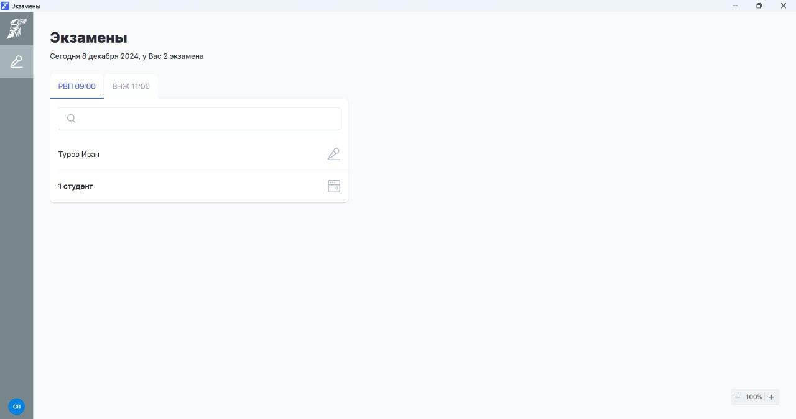

# Экзамен. Проведение

:::info

Во время инструктажа сдающий получает [код](skachat-kody-dlya-vkhoda-sdayushikh.md) для входа на экзамен

:::

В функцию экзаменатора, который находится в аудитории с пишущими письменную часть сдающими, входит:\
1\. проводит вводную часть, рассказывает об экзамене

&#x20;2\. помогает всем сдающим открыть экзамен и проверяет, чтобы сдающий вошел по своему коду

3. отвечает на вопросы технического плана. Например, помогает переключить на русскую раскладку клавиатуру, если это не проверено перед экзаменом или подсказывает, как удалить случайно напечатанный символ.&#x20;

:::info

Что делать, если заметили, что **сдающий списывает**?

При выявлении фактов списывания, разговоров во время проведения теста или нарушения других правил кандидат будет исключен из процесса тестирования. В таком случае ему не будет выдан сертификат, а оплаченные средства за тест не подлежат возврату. Подробнее с правилами можно ознакомиться по [ссылке](https://yadi.sk/i/_VcE1isnITs4RA).

:::

## Тестирование

На компьютерах сдающих должно быть установлено и запущено [приложение](prilozhenie.-pismennaya-i-ustnaya-chasti-ekzamena.md),  включена русская раскладка клавиатуры. Экзамен не может длиться менее 10 минут, завершить его ранее технически нельзя.&#x20;

| Действия                                                                                                                                                                                                                                                                                                                    | Отображение в Odin                                                         |
| --------------------------------------------------------------------------------------------------------------------------------------------------------------------------------------------------------------------------------------------------------------------------------------------------------------------------- | -------------------------------------------------------------------------- |
| **Сдающий** садится за компьютер, вводит код и нажимает "Войти"                                                                                                                                                                                                                                                             |  |
| **Сдающий** проверяет, что хорошо слышит в наушниках, и нажимает "Далее"                                                                                                                                                                                                                                                    |  |
| 
Визитка <strong>в приложении</strong>: 1. Сдающий слушает автовоспроизведение информации об экзамене
<ol start="2"><li>представляется, называет ФИ или ФИО как в документе, удостоверяющем личность</li><li>показывает свой паспорт так, чтобы его было хорошо  видно на экране и картинка была читаемой</li></ol> |  |
| **Сдающий** нажимает кнопку "Начать"                                                                                                                                                                                                                                                                                        |  |
| 
<strong>Сдающий</strong> отвечает на вопросы теста. (Обратите внимание, что в тесте присутствуют аудиовопросы, для их прослушивания потребуются наушники)
                                                                                                                                                         |  |
| 
<strong>Сдающий</strong>, ответив на все вопросы, завершает тест. Либо тест завершится <strong>автоматически</strong>, когда закончится время, отведенное на экзамен. -- Приложение будет открыто на странице ввода кода для следующего экзамена.
                                                           |  |

***

После того как закончится тестирование (письменная часть экзамена) компьютер сдающему больше не потребуется.

Результаты прохождения тестов размещены в активности. Там же отображается информация о всех попытках и о том, сколько и за какую часть теста экзаменуемый получил баллов.

<figure><figcaption></figcaption></figure>

Если сдающий уже проходил экзамен по определенному типу, то при повторной сдаче экзамена ему не попадется вариант, который уже попадался до этого.

Также минимизирована вероятность выдачи одинаковых вариантов теста сдающим в рамках одного экзамена: алгоритм выдачи попытки сначала выдает "свободные" варианты случайным образом ("свободные" - те которые ещё никому не выдавались) и только после их исчерпания, начинает выдавать по второму кругу, также случайным образом, если это необходимо (количество попыток превышает количество вариантов в тесте).

Например, если в тесте 10 вариантов и в экзамене 10 сдающих, то каждый сдающий должен получить свой уникальный вариант. Если 10 вариантов и 15 с, то тому кто начинает тест первым, выдается случайный вариант из 10 доступных, второму уже случайно из 9 вариантов, третьему из 8 вариантов и т.д. На 11-ом сдающем "свободные" варианты заканчиваются (т.к. каждый был выдан по одному разу), в этом случае начнется новый круг, т.е. выдается случайный из 10 доступных, 12-му сдающему из 9 доступных и т.д.

## Устная часть (РВП/ВНЖ)

Вторую часть экзамена - говорение проводит только экзаменатор.\
Сдающих следует приглашать по очереди к себе и проводить устную часть.



| Действие                                                                                                                                                                                                                                                                                                                               | Отображение в приложении Odin                                                                                        |
| -------------------------------------------------------------------------------------------------------------------------------------------------------------------------------------------------------------------------------------------------------------------------------------------------------------------------------------- | -------------------------------------------------------------------------------------------------------------------- |
| **Экзаменатор** после [установки приложения](prilozhenie.-pismennaya-i-ustnaya-chasti-ekzamena.md) на ПК, где будет проходить устная часть,  входит "как сотрудник"                                                                                                                                                                    |  |
| **Экзаменатор** входит свои логин и пароль от Odin                                                                                                                                                                                                                                                                                     |                                                                                                                      |
| **Экзаменатор** выбирает экзамен (будут только экзамены текущего дня)  и приглашает к себе сдающего                                                                                                                                                                                                                                    |      |
| **Экзаменатор** кликает по микрофону, напротив человека, которого пригласили к себе для сдачи устной части.                                                                                                                                                                                                                            |                                            |
| **Экзаменатор** совмесно со **сдающим** записывают [видеовизитку](../rekomendacii/obrazec-videovizitki-pered-startom-ustnoi-chasti-ekzamena.md) на камеру ПК и начинают устную часть. Кнопка "Следующий вопрос" откроет его. В вопросе 3 для РВП или 4 для ВНЖ будет кнопка "Завершить" = Завершение устной части для этого сдающего.  |                                            |
| **Экзаменатор** может отпустить  сдающего, сразу выставить баллы за вопросы устной части и проверить вопросы письменной или позвать следующего сдающего, затем выставить баллы всем участникам экзамена.                                                                                                                               |  |
| **Экзаменатор** после завершения устной части выходит из приложения (Не выключайте сразу компьютер, видео с компьютера передаётся автоматически в Odin, на это потребуется некоторое время).                                                                                                                                           |                                                                                                                      |






