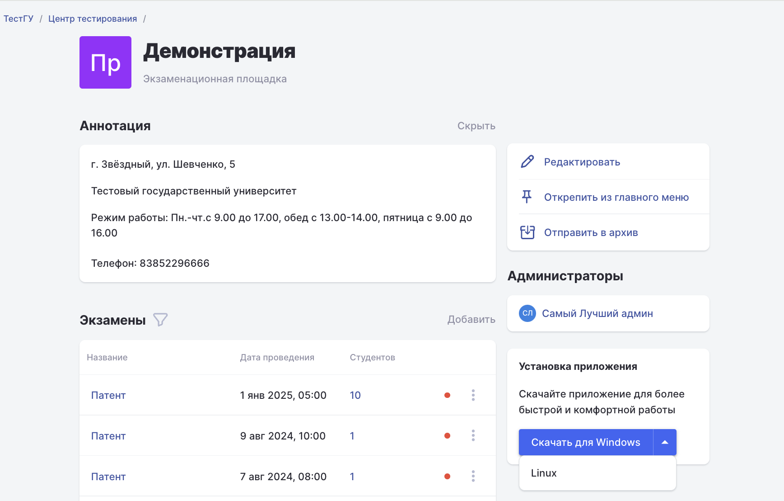
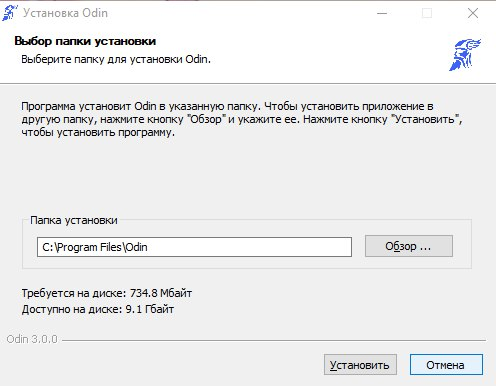
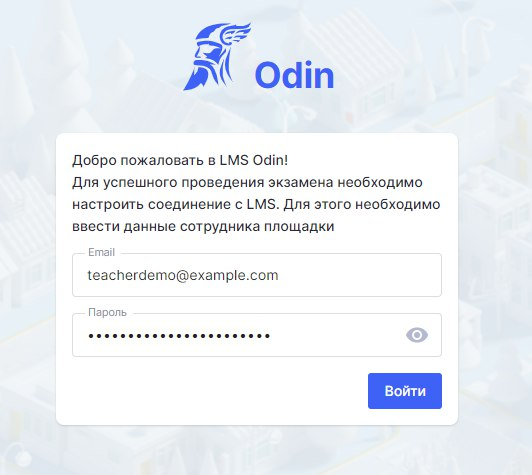
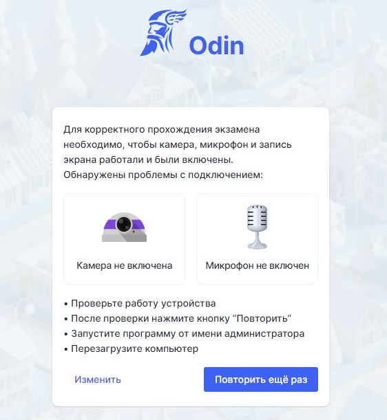
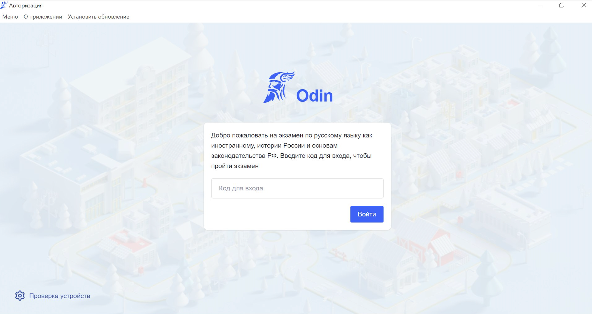
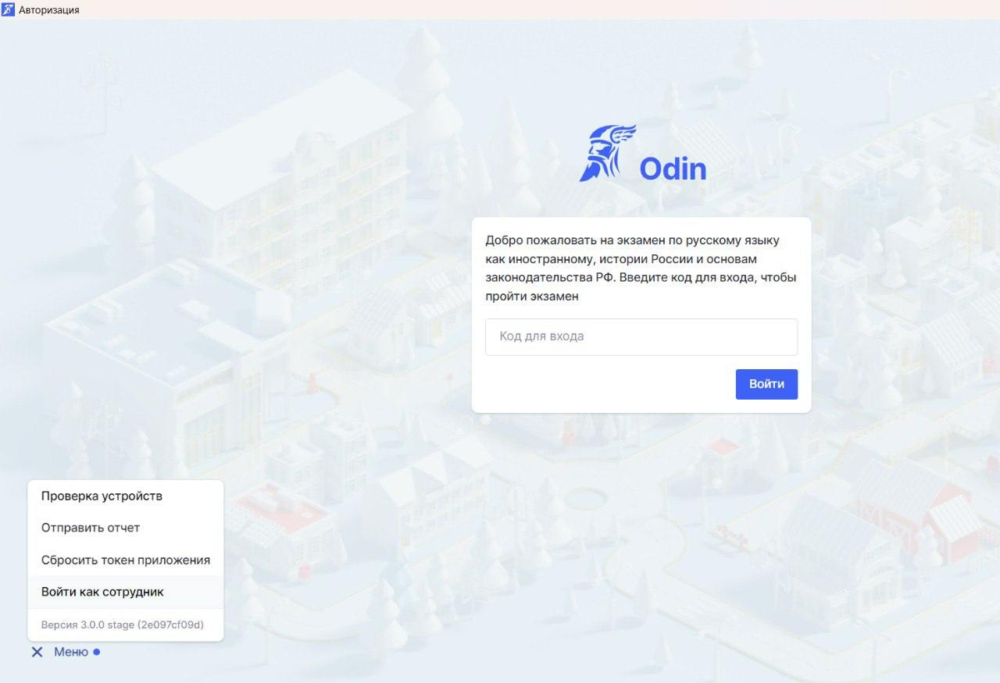

Приложение позволит записать экзамен сдающего, даже если на какое-то время пропадёт интернет

## Где скачать приложение?

Cкачать приложение :

[Windows](https://www.odin.study/api/migrationExamApp/download/Win32)

[Linux](https://www.odin.study/api/migrationExamApp/download/Linux)

или на странице вашей площадки в Odin.

{width=1736px height=1108px}

## Как установить приложение?

Установите приложение на все компьютеры, где будут проводиться экзамены.

1\. Установите приложение и запомните, куда вы его установили (записи должны сохраняться в каталоге пользователя на системном диске, обычно `C:\\Users\{UserName}\Odin\records`  - сюда сразу после завершения теста попадёт запись экзамена и её сразу же можно будет посмотреть, не дожидаясь кодирования).

{width=496px height=386px}

2\.  Сделайте рекомендованные в приложении настройки, дойдя до страницы ввода кода на экзамен,  - это стартовая страница для сдающих.

{width=532px height=475px}

{width=571px height=513px}

{width=562px height=611px}

{width=917px height=745px}

## Старт экзамена. Письменная часть

Настройка завершена, сдающий может приступить к экзамену, введя код.

{width=2304px height=1224px}

## Старт экзамена. Устная часть

В меню приложения войдите как сотрудник. Потребуется ввести логин и пароль экзаменатора.

{width=1280px height=875px}

### Куда сохранятся видео экзамена?

Видео сохранятся на ПК, где проводилось тестирование/устная часть, обычно в папку C:\\Users\{UserName}\\Odin\\records, сразу после завершения экзамена их можно посмотреть. Также автоматически видео будут загружены на страницу Итога экзамена сдающему в Odin (не выключайте компьютер сразу после завершения экзамена, чтобы видео успели попасть в Odin).