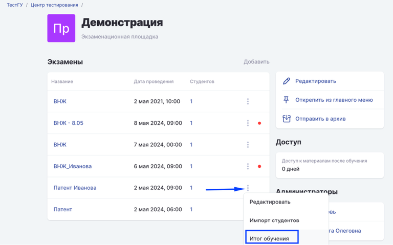
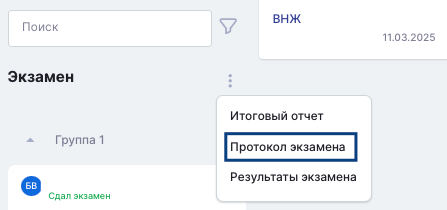
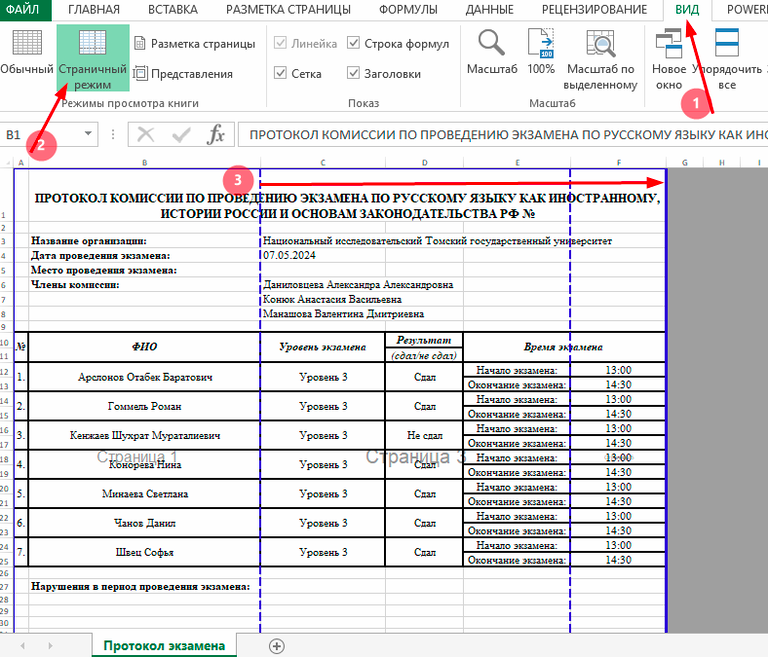
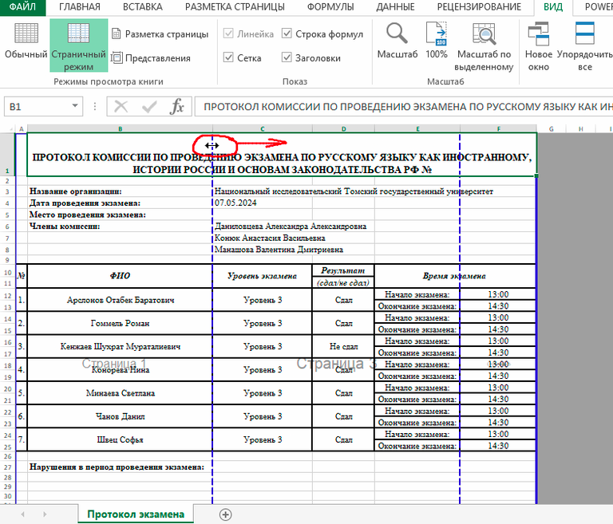

### Где найти?

Для того чтобы скачать протокол экзамена необходимо на странице со списком экзаменов нажать три точки и выбрать "Итог обучения", затем открыть "Протокол экзамена".

{width=768px height=479px}

{width=447px height=210px}

. Начало экзамена - время начала попытки теста. Окончание экзамена - время завершения студентом письменной части (момент завершения прохождения теста)."){width=753px height=656px}

"){width=768px height=347px}

### Как распечатать?

Печатать протокол необходимо в постраничном режиме.

1. Зайти в раздел Вид -> Страничный режим

2. Передвиньте границы страницы

3. При необходимости сократить ширину некоторых столбцов.

4. При печати можно указать "Узкие поля", чтобы корректно распечатать документ.

   {width=768px height=657px}

   {width=768px height=657px}