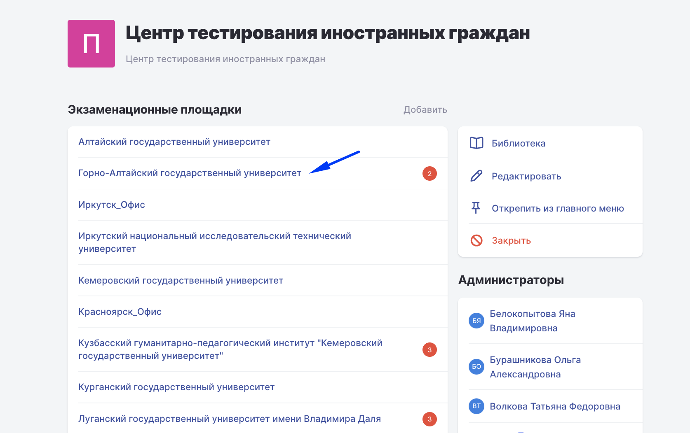
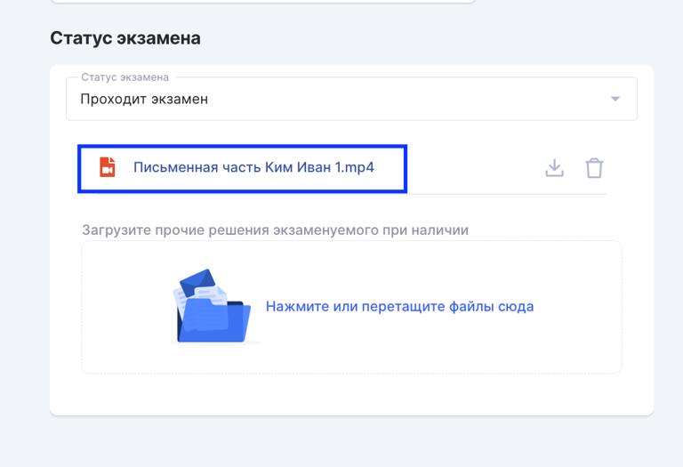
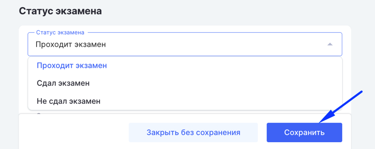

**Администратор центра тестирования иностранных граждан проверяет итоги каждого экзамена (администраторы площадки могут только просмотреть записи экзамена по каждому сдающему)**

1. На странице [Центра тестирования](https://www.odin.study/ru/Division/Info/2924) открыть Экзаменационную площадку. Счётчик подскажет, сколько экзаменов требуют проверки.

   {width=768px height=482px}

2. На странице Экзаменационной площадки в строке с Экзаменом для проверки нажать три точки и выбрать "Итог экзамена". Красный кружок подскажет, какие экзамены требуют проверки.

   {width=768px height=540px}

3. Просмотреть запись/записи экзамена по каждому сдающему

   {width=768px height=525px}

4. Выставить статус экзамена и сохранить.

   {width=768px height=306px}

---

Если для проверки экзамена требуется посмотреть ответы, которые давал сдающий и баллы, которые выставил экзаменатор за открытые вопросы, можно кликнуть на наименование экзамена и [посмотреть ответы по инструкции](https://app.gram.ax/github.com/Smile-Tech-Study/Flow_-IM_help/main/-/centr-testirovaniya-v-odin/proverka-otkrytykh-voprosov-v-testirovanii).

.png)