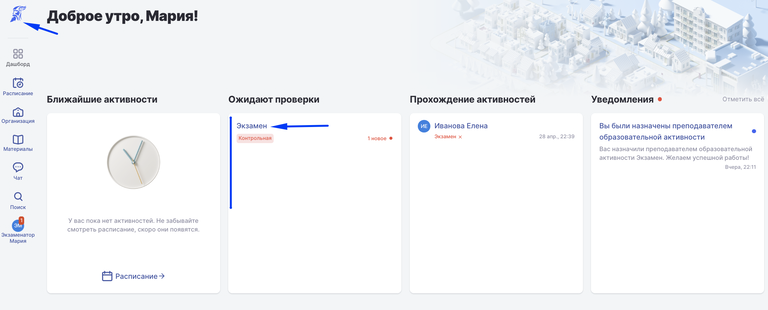
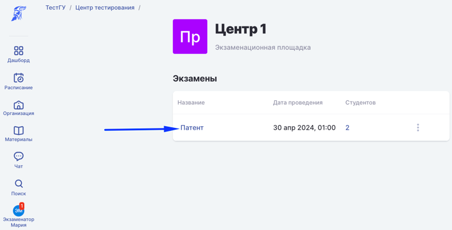
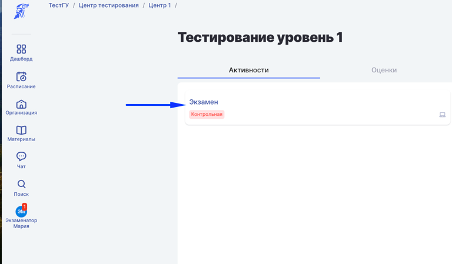
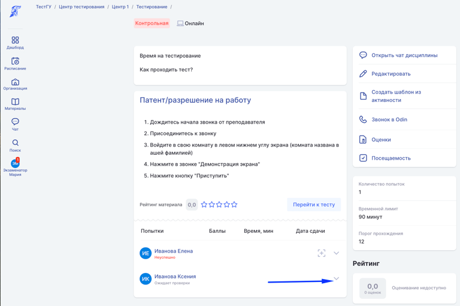
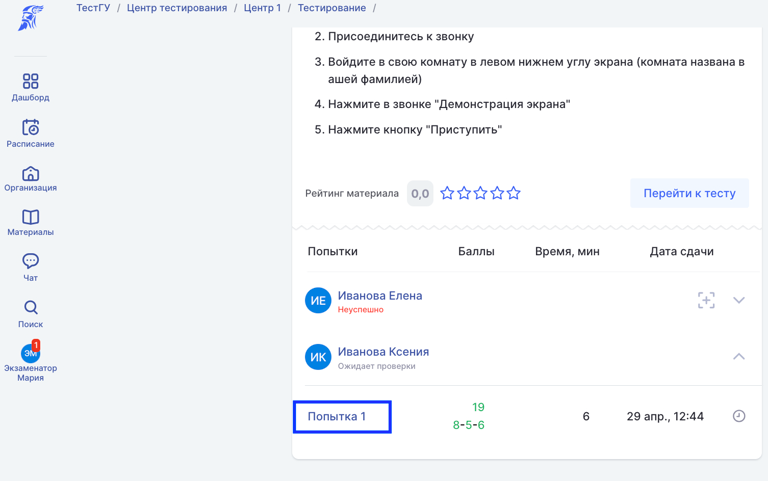
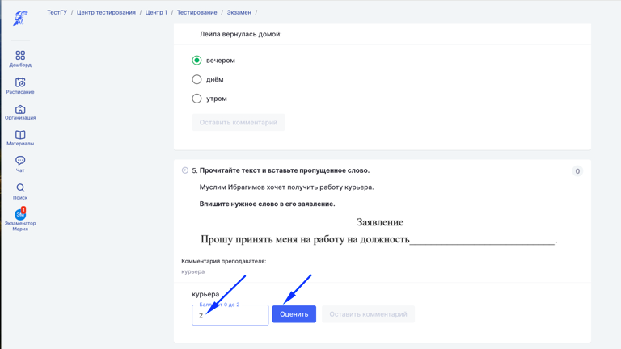

:::info 

Закрытые вопросы - вопросы, где студент выбирает один из предложенных вариантов ответа. Такие вопросы проверяются автоматически.

Открытые вопросы - вопросы, где студент печатает ответ на вопрос, а Экзаменатор после завершения тестирования, проверяет ответ студента

:::

## **Этапы проверки открытых вопросов**

Есть два пути для проверки ответов, можно выбрать любой.

В варианте 1 все тесты по всем уровням, требующие проверки.

В варианте 2 открывается конкретный экзамен и последовательно проверяются ответы каждого, затем переходят к следующему экзамену.

### **Шаг 1. Откройте страницу тестирования**

[tabs]

[tab:Открыть из дашборда экзаменатора]

Открыть дашборд и в блоке "Ожидают проверки" нажать на название Экзамен (Патент/РВП/ВНЖ)

{width=768px height=310px}

[/tab]

[tab:Открыть со страницы экзамена]

В списке экзаменов на странице площадки кликните по той записи, где будете проверять

{width=768px height=392px}

Кликните по Экзамену

{width=768px height=449px}

[/tab]

[tab]

[/tab]

[tab]

[/tab]

[/tabs]

### **Шаг 2. Разверните запись, в статусе "Ожидает проверки"**

{width=768px height=510px}

### **Шаг 3. Откройте попытку**

{width=768px height=481px}

### **Шаг 4. Выставите оценку за отрытые вопросы**

{width=768px height=432px}