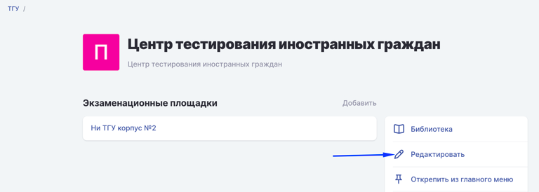
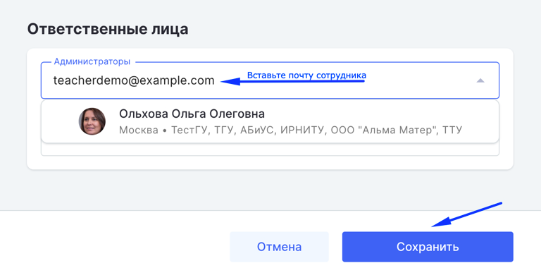
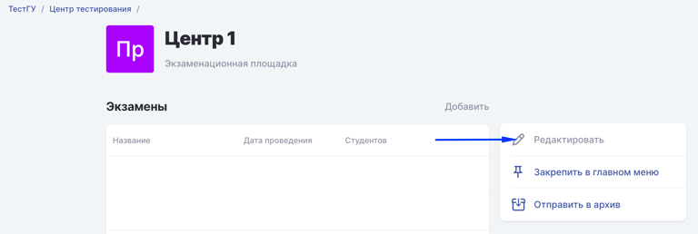
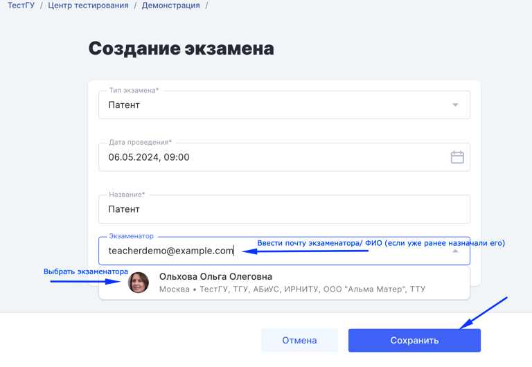

Регистрация сотрудников **Центра тестирования** доступна по ссылке <https://www.odin.study/ru/Account/Register>

:::tip 

**После свободной регистрации в Odin сотруднику можно назначить роль.**

:::

## **Какие роли понадобятся?**

1. Администратор центра тестирования - курирует и проверяет ЦС.

2. Администратор площадки (Площадка - место проведения экзамена) - создает экзамен.

3. Экзаменатор (в терминологии Odin - преподаватель) - проводит экзамен.

## **Как назначить роль?**

[tabs]

[tab:Администратор центра тестирования]

На странице [Центра тестирования](https://www.odin.study/ru/Division/Info/2924) необходимо нажать на карандашик.

{width=768px height=274px}

В поле Администраторы найдите сотрудника и сохраните.

{width=768px height=397px}

Далее Администратор Центра тестирования может создавать площадки для проведения экзаменов.

[/tab]

[tab:Администратор площадки]

1. Администратор центра на странице [Центра тестирования](https://www.odin.study/ru/Division/Info/2924) добавляет [Площадку](https://informa.gitbook.io/immigraciya/centr-testirovaniya-v-odin/dobavit-ploshadki).

2. На странице созданной Площадки нажимает на кнопку "Редактировать"

   {width=768px height=258px}

3. В блоке "Ответственные лица" вводит почту Администратора площадки и сохраняет

[/tab]

[tab:Экзаменатор]

Администратор площадки [создаёт экзамен](https://informa.gitbook.io/immigraciya/centr-testirovaniya-v-odin/dobavit-ekzamen) и в поле Экзаменатор выбирает экзаменатора.

{width=768px height=530px}

[/tab]

[/tabs]