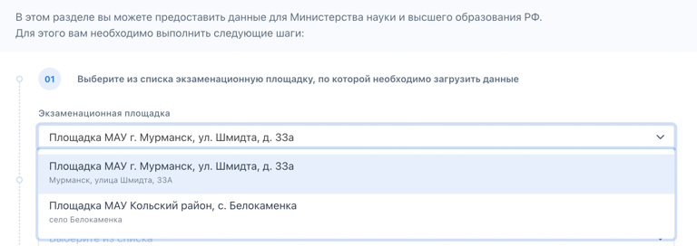
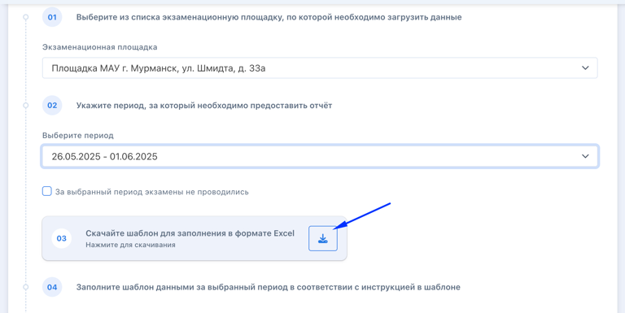
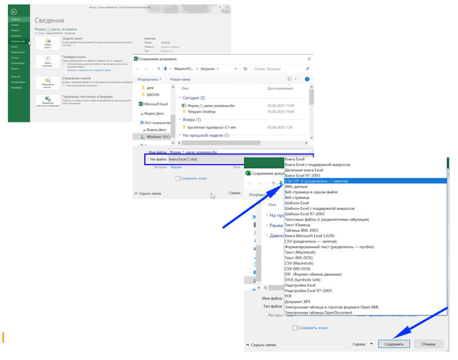
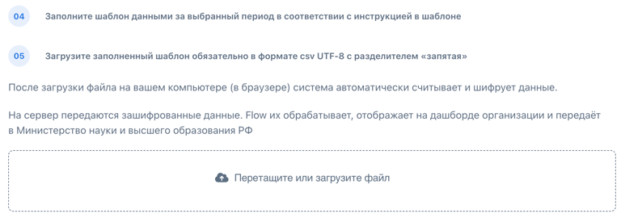
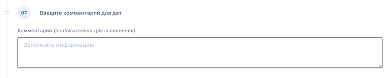

:::info 

Площадкам, которые полностью проводят экзамены во Flow+Odin, не требуется загрузка данных отчетов.

Если площадка проводит во Flow+Odin не все экзамены, либо по состоянию на отчетную неделю не полностью перешла на использование Flow+Odin, данные требуется загружать полностью. Отчёты будут генерироваться и отправляться автоматически.

:::

В первый день рабочей недели в пункте меню "Отчеты" для пользователей с ролью "Оператор данных" еженедельно необходимо заполнять шаблон с данными и загружать его во Flow с целью последующего формирования отчетности для Минобрнауки России.

Отправка данных проходит в зашифрованном виде посредством системы Flow.

{width=768px height=373px}

Для отправки отчета необходимо пошагово выполнить следующие действия:

**ШАГ 1.** Выбрать из списка экзаменационную площадку, по которой загружаются данные.

{width=768px height=272px}

**ШАГ 2.** Указать период, за который предоставляется отчет.

В случае если в выбранный период на указанной площадке экзамены не проводились, соответствующая информация обязательно должна быть внесена в форму для формирования отчета. В этом случае необходимо отметить галочку "За выбранный период экзамены не проводились" и обязательно оставить комментарий о причинах в последнем поле формы.

{width=768px height=275px}

**ШАГ 3.** Скачать шаблон в формате Excel для дальнейшего заполнения данными за неделю.

{width=768px height=385px}

**ШАГ 4.** Заполненный шаблон **сохранить в формате CSV UTF - 8** с разделителем "запятая".

:::tip 

**Как сохранить в формате CSV?**

1. Откройте скачанный шаблон

2. Заполните его данными

3. Нажмите "Сохранить как"

4. В строке "Тип файла" выберите \*csv utf-8 (разделитель - запятая)

5. Сохраните

{width=768px height=604px}

:::

**ШАГ 5.** После загрузки заполненного шаблона в формате **\*csv utf-8** с разделителем "запятая" **во Flow**, эти данные будут отображаться на дашборде (находится в разработке) для центра тестирования и для Минобрнауки России.

{width=768px height=275px}

**ШАГ 6**. После этого ввести (при наличии) даты в поля:

:::note 

Для заполнения шага 6 необходимо определить ближайшие даты экзаменов для каждого уровня, учитывая наличие свободных мест, т.е. необходимо ввести дату будущего экзамена, на который возможно записаться сегодня (то есть в дату, когда заполняется шаг 6).

По данным с шага 6 будет строиться статистика по глубине записи на экзамен каждого уровня для выбранной площадки.

Пример, если, сегодня 3 июня 2025 года, то:

-  Для уровня Патент: ближайшая дата экзамена с наличием свободных мест - 10 июня 2025 года.

-  Для уровня РВП: ближайшая дата экзамена с наличием свободных мест - 5 июня 2025 года.

-  Для уровня ВНЖ: ближайшая дата экзамена с наличием свободных мест - 9 июня 2025 года.

Таким образом, для заполнения шага 6 следует указать следующие даты:

-  Патент: 10.06.2025

-  РВП: 05.06.2025

-  ВНЖ: 09.06.2025

:::

-  "Ближайшая доступная дата для записи на экзамен на разрешение на временное проживание (РВП)",

-  "Ближайшая доступная дата для записи на экзамен на вид на жительство (ВНЖ)".

{width=768px height=346px}

**ШАГ 7.** (Необязательно) оставить комментарий для дат экзаменов (по работе площадки)?                           

{width=768px height=155px}

\
**ШАГ 8.** Загрузить данные

{width=768px height=143px}

### На вкладке "История" на странице "Отчеты" пользователь сможет:

-  посмотреть загруженные ранее данные,

-  удалить уже загруженные данные и отредактировать введенные данные в течение 2-х часов после загрузки.

{width=768px height=190px}