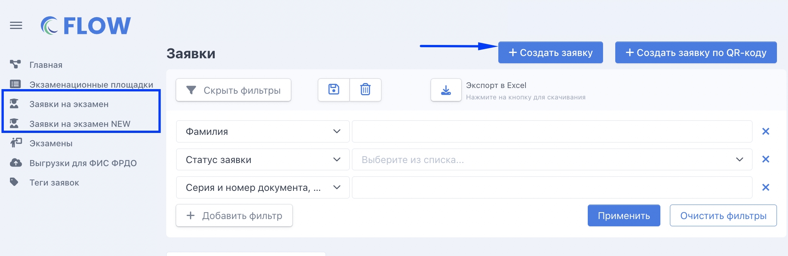
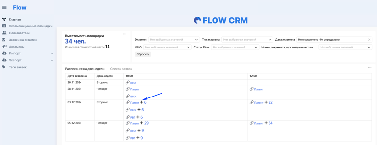
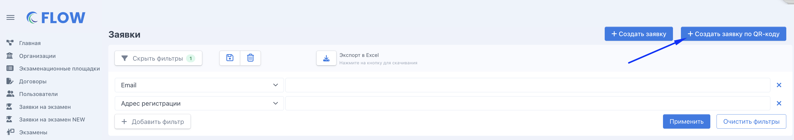
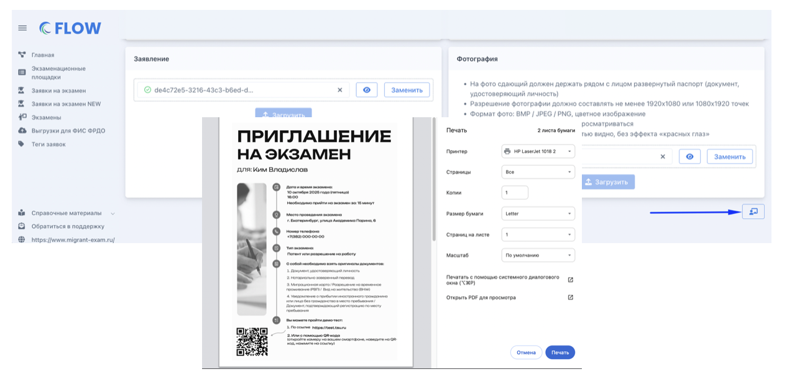

Заявку можно добавить в систему со страницы "Заявки на экзамен" или "Главная" (предпочтительнее, так как сразу будет предзаполнено несколько полей). Все дальнейшие изменения в заявке возможны только на странице редактирования по кнопке "Редактировать".

{width=531px height=556px}


[tabs]

[tab:Из списка заявок]

1. Откройте страницу "Заявки на экзамен"

2. Создайте заявку

   {width=768px height=305px}

[/tab]

[tab:Главная]

1. Откройте страницу "Главная"

2. Нажмите "+" в экзамене, куда добавляется заявка. "+" будет только в будущих экзаменах, где есть места. [Подробнее](https://informa.gitbook.io/immigraciya/flow.-rabota-s-dokumentami/kvota-na-ekzamen.-gde-posmotret)

   {width=768px height=296px}

[/tab]

[tab:По QR-коду ПВС]

Иностранный гражданин обращается в окно ПВС, приносит туда все необходимые документы, ему выдают QR-код. Этот код необходимо предоставить сотруднику экзаменационной площадки.

Сотрудник площадки:

1. Переходит на страницу Заявки на экзамен - "Создать заявку по QR-коду".

   {width=768px height=300px}

   ```
    **a.** Разрешает использование камеры для <https://flow.migrant-exam.ru/> (если это не было сделано ранее)
   ```

{width=768px height=341px}

```
     **b.** Помещает QR-код в область видимости камеры компьютера.
```

{width=768px height=306px}

С QR-кода считываются данные человека и создается заявка.


Сотрудник дозаполняет созданную заявку недостающими данными и сканами документов.

В дальнейшем при создании заявки из QR-кода планируется получать больше необходимых для заполнения заявки данных и сканы документов.

[/tab]

[/tabs]


**3\.** Заполните данные сдающего и загрузите сканы его документов. [Подробнее о заполнении каждого поля.](./zapolnenie-polei-v-zayavke)

:::info 

Если каких-то данных нет или сканы документов загружаются после создания заявки/другим сотрудником, то заявка сохранится и можно будет вернуться на страницу её редактирования.

:::

{width=768px height=1108px}

**4\.** После заполнения всех полей можно "Перейти к оплате" или нажать "Оплатить позже"= вернуться в список заявок.

\--

На странице создания/редактирования заявки доступна возможность распечатать приглашение.

{width=768px height=537px}


Также печать приглашения доступна со страницы заявки и из личного кабинета сдающего.

{width=524px height=291px}