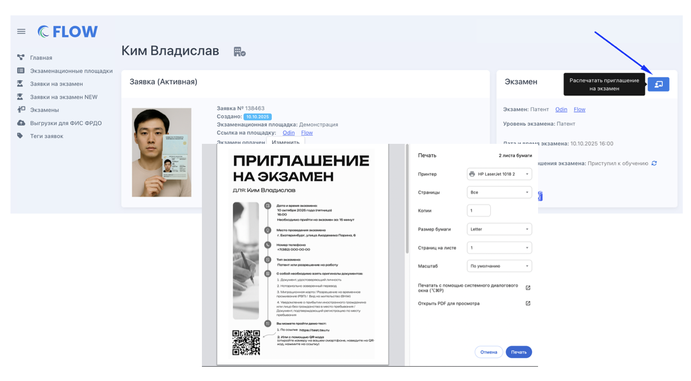
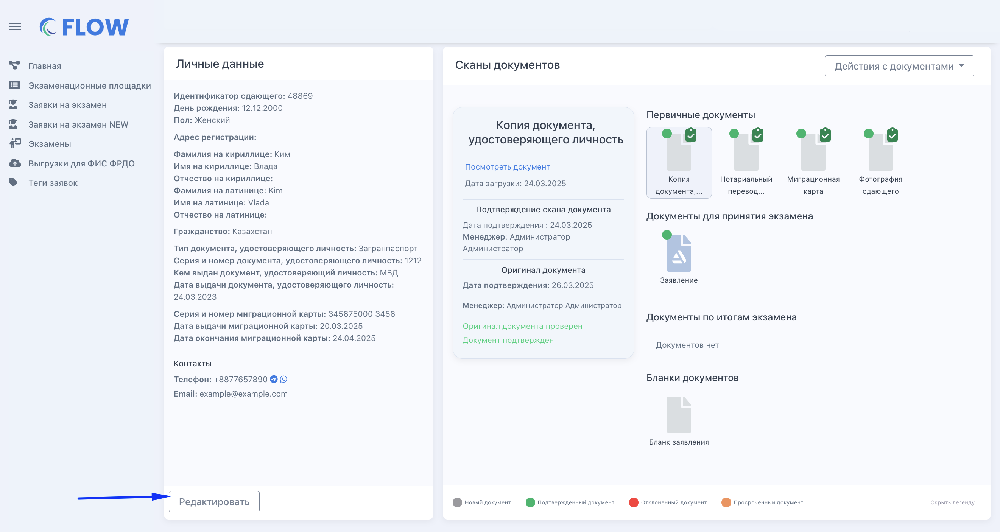

## Создать заявку одним из 3-х способов

:::tip 

Заявку можно добавить в систему со страницы "Заявки на экзамен" или "**Главная**" (предпочтительнее, так как сразу будет предзаполнено несколько полей).

:::

[tabs]

[tab:Из списка заявок]

1. Откройте страницу "Заявки на экзамен"

2. Создайте заявку

   {width=2062px height=672px}

[/tab]

[tab:Главная]

1. Откройте страницу "Главная"

2. Нажмите "+" в экзамене, куда добавляется заявка. "+" будет только в будущих экзаменах, где есть места.[ Подробнее](./../kvota-na-ekzamen.-gde-posmotret)

   {width=768px height=296px}

[/tab]

[tab:По QR-коду ПВС]

Иностранный гражданин обращается в окно ПВС, приносит туда все необходимые документы, ему выдают QR-код. Этот код необходимо предоставить сотруднику экзаменационной площадки.

Сотрудник площадки:

1. Переходит на страницу Заявки на экзамен - "Создать заявку по QR-коду".

{width=3188px height=566px}

Разрешает использование камеры для  [https://flow.migrant-exam.ru](https://flow.migrant-exam.ru/) если это не было сделано ранее)

{width=768px height=341px}

Помещает QR-код в область видимости камеры компьютера.

{width=768px height=306px}

1. С QR-кода считываются данные человека и создается заявка.

Сотрудник дозаполняет созданную заявку недостающими данными и сканами документов.

[highlight:grayish-blue]В дальнейшем при создании заявки из QR-кода планируется получать больше необходимых для заполнения заявки данных и сканы документов[/highlight].

[/tab]

[/tabs]

**3\.** Заполните данные сдающего и загрузите сканы его документов. [Подробнее о заполнении каждого поля.](./zapolnenie-polei-v-zayavke)

:::info 

Если каких-то данных нет или сканы документов загружаются после создания заявки/другим сотрудником, то заявка сохранится и можно будет вернуться на страницу её редактирования.

:::

{width=768px height=1108px}

**4\.** После заполнения всех полей можно "Перейти к оплате" или нажать "Оплатить позже"= вернуться в список заявок.

## Распечатать приглашение на экзамен

[tabs]

[tab:На странице создания/редактирования]

При создании или редактировании заявки в правом нижнем углу страницы

{width=1274px height=624px}

[/tab]

[tab:На странице заявки]

На странице заявки в блоке «Экзамен»

{width=1256px height=694px}

[/tab]

[/tabs]

## Редактирование/дополнение/ изменения в созданной заявке

Все дальнейшие изменения в заявке возможны только на странице редактирования по кнопке "Редактировать".

{width=2642px height=1406px}