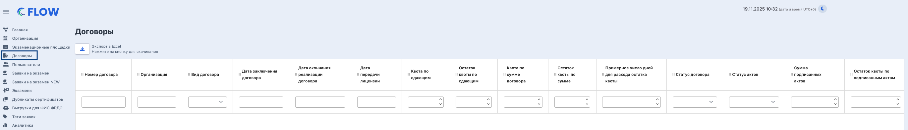
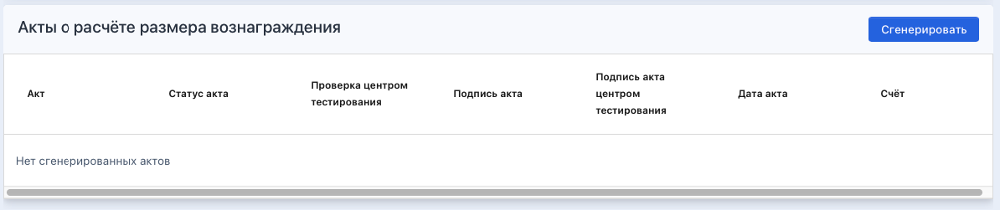
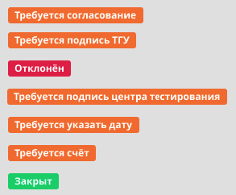
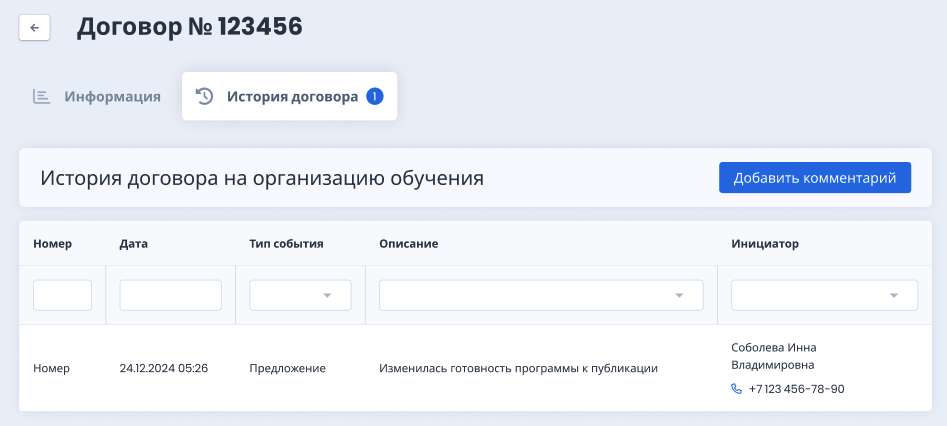

В главном меню доступен раздел "Договоры".

В этом разделе расположена таблица с договорами  с указанием квот.

{width=2740px height=396px}

С этой страницы можно перейти в уже существующий договор или создать новый договор. Производится непрерывный мониторинг выполнения квот и примерный расчет, через сколько дней договор закончится, в зависимости от среднего количества экзаменов в системе.

## Акты

На странице договора есть блок "Акты о расчете размера вознаграждения», генерация происходит по кнопке «Сгенерировать».

{width=1194px height=251px}

Выбранный шаблон акта зависит от вида договора: Лицензионный/Сублицензионный.

Период в шаблонах в строке "Размер роялти за период" зависит от того, как генерируется Акт:\
\- если автоматически в первое число месяца, следующего за отчетным, И если договор был заключен не в отчетном месяце, а раньше, то период будет с первого дня отчетного месяца до последнего дня отчетного месяца,\
\- если автоматически в первое число месяца, следующего за отчетным, И если договор был заключен в отчетном месяце, то период будет со дня заключения договора до последнего дня отчетного месяца,\
\- если вручную И если договор был заключен не в отчетном месяце, а раньше, то период будет с первого дня отчетного месяца до дня генерации Акта,\
\- если вручную И если договор был заключен в отчетном месяце, то период будет со дня заключения договора до дня генерации Акта.

Показатель "Количество принявших участие в сдаче Экзамена граждан иностранных государств и лиц без гражданства, человек" считает количество тех, кто реально приступил к экзамену в Odin. И не важно успешно сдан экзамен или не успешно.

В адреса в реквизитах подставляется только то, что будет внесено в поле "Юридический адрес" в карточке организации.

:::lab:true Этапы работы с Актом

1. Генерируется новый акт из блока "Акты о расчете размера вознаграждения» по кнопке «Сгенерировать». В этом блоке может быть много актов. Они будут генерироваться и подписываться раз в месяц пока не закончится квота в договоре.

2. В первое число каждого месяца, следующего за отчетным, система по шаблону генерирует акт к каждому договору, в котором еще есть квота.

3. Либо в текущем месяце, если договор завершается, пользователь с ролью "Представитель ТГУ" кликает на кнопку "Сгенерировать" и генерируется акт к данному договору.

4. В качестве названия Акта подставляется месяц, за который сгенерирован Акт. Если Акт сгенерирован автоматически в первое число месяца, следующего за отчетным. Например, сгенерирован 1 августа, значит название Акта будет "Июль", потому что Акт сгенерирован за июль.\
   Если Акт сгенерирован вручную, например 10 августа, значит название Акта будет "Август", потому что Акт сгенерирован за период с 1 августа по 10 августа.

5. Сгенерированный Акт находится в статусе "Требуется согласование". Все статусы Актов:

   {width=293px height=242px}

6. Сотрудник центра тестирования сгенерированные акты проверяет (на предмет подставленных данных организации, подписанта и количества лиц, прошедших экзамен):\
   \- подтверждает (кнопка “Подтвердить”) - акт переходит в статус "Требуется подпись ТГУ" ,\
   \- или отклоняет с указанием причин отклонения в (кнопка "Отклонить") - акт переходит в статус "Отклонен".

7. Причина отклонения, записанная в модальном окне, будет отображаться в истории договора.

   {width=947px height=426px}

8. После подтверждения акта представитель ТГУ подписывает акт со стороны ТГУ (ручной подписью вне системы), загружает во Flow подписанный pdf файл. Когда сотрудник ТГУ загрузит скан подписанного Акта, можно будет скачать акт, подписать его и загрузить в систему. Акт находится в статусе "Требуется подпись центра тестирования".

9. Сотрудник центра тестирования скачивает скан с подписью ТГУ, подписывает его со своей стороны, загружает скан с двумя подписями.

10. Акт переходит в статус "Требуется указать дату".

11. Представитель ТГУ ставит дату акта.

12. Акт переходит в статус "Требуется счет".

13. Представитель ТГУ загружает скан счета на оплату. Акт переходит в статус "Закрыт".

14. Статусы актов отображаются в таблице со списком договоров.

15. Также в столбце "сумма подписанных актов" в списке договоров и в общей информации о  отображается сумма из всех актов договора, которые находятся в статусе "Закрыт".

16. В столбце "остаток квоты по подписанным Актам" в списке договоров и в общей информации о договоре отображается остаток от суммы договора=сумма договора-сумма подписанных актов, которые находятся в статусе "Закрыт".

:::

## Квоты

Между ТГУ и центрами тестирования заключаются по два договора (на Flow и на Odin), в которых фиксируются квоты по сдающим и квоты в деньгах. Эти данные фиксируются в самом договоре и отображаются на странице договора и в списке договоров.\
Сравнить количество заявок, которые должны быть в квоте можно, например, по дашборду: <https://datalens.yandex.cloud/7zasrezsdg6wu-formirovanie-schyota?tab=wK>

:::lab:true Мониторинг выполнения квот

Договоров в системе может быть  много. Но в один момент времени может действовать только один Сублицензионный договор и один Лицензионный договор.\
Заявку необходимо прикреплять к тем договорам, которые действуют в это время, даже если в предыдущих договорах осталась квота.\
Срок действия договора определяется его параметрами "дата заключения договора" и "дата окончания реализации договора".

После того, как заявка "прицепилась" к договорам, эти договоры отобразятся на странице заявки.

В списке заявок добавлены два столбца: Лицензионный договор, Сублицензионный договор. 

Если во Flow у заявки был удален статус завершения экзамена - значит заявка "отцепится" от обоих договоров. Поля с договорами очистятся.

Запись в квоту конкретного договора конкретной заявки и Удаление из квоты конкретного договора конкретной заявки будут зафиксированы в истории заявки.

Остаток квоты по сдающим сокращается в момент, когда Flow получает из Odin статус экзамена.\
Остаток квоты по сдающим = Квота по сдающим - Количество "прицепленных" к договору заявок.

Остаток квоты по сумме зависит от остатка квоты по сдающим и от типа договора.\
*Лицензионный договор:*\
Остаток квоты по сумме = Квота по сумме договора - 250 руб\**Количество "прицепленных" к договору заявок\
Сублицензионный договор:\
Остаток квоты по сумме = Квота по сумме договора - 300 руб\**Количество "прицепленных" к договору заявок

Если квота по сумме перерасходована, например, заявка "насильно" прицеплена к договору, то могут быть отрицательные числа в остатках.

Примерное число дней для расхода остатка квоты = Остаток квоты по сдающим / Среднее количество заявок, цепляемых к договору ежедневно за последний месяц&

:::

