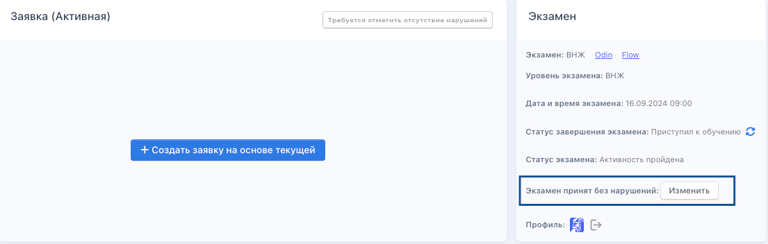
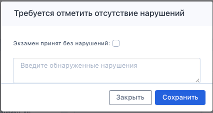
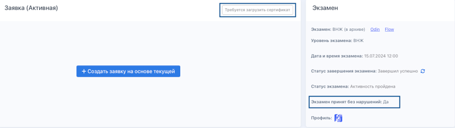
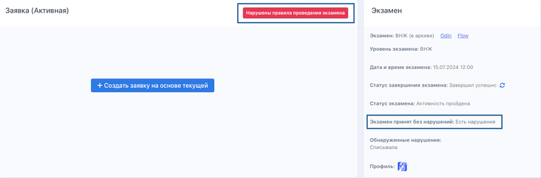

Если экзамен завершился, требуется поставить отметку о том, были ли какие-то нарушения с его стороны (списывал, например) или нарушений не было.

Для выставления такой отметки **проверяющему со стороны головного Центра тестирования** следует:

-  отфильтровать заявки в статусе "Требуется отметить отсутствие нарушений"

-  зайти в каждую заявку и блоке Экзамен и нажать на "Изменить".

   {width=1105px height=352px}

-  во всплывающем окне можно поставить галочку, что экзамен принят без нарушений/ либо оставить комментарий о нарушениях.

-  после внесения информации следует нажать на "Сохранить".

   {width=426px height=227px}

---

Если экзамен принят без нарушений, заявка перейдет в статус "Требуется загрузить сертификат", в поле Экзамен будет указано "Да".

{width=768px height=216px}

Если же отметить выявленные нарушения, то статус заявки перейдет в "Нарушены правила проведения экзамена", а в блоке Экзамен будет указано, что "Есть нарушения".

{width=768px height=253px}

В этом случае сдающий должен заново записаться на экзамен и повторно его оплатить.