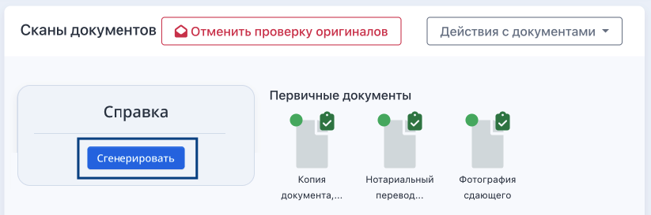
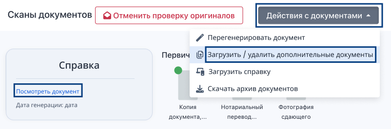
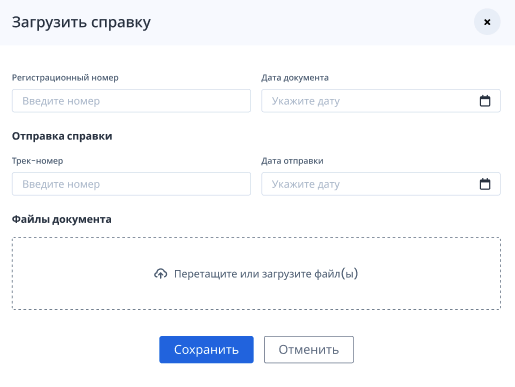

В системе реализована генерация бланка справки по шаблону.

[Справка при неуспешной сдаче.docx](<./Справка при неуспешной сдаче.docx>)

Для заявок, неуспешно сдавших экзамен, генерируется бланк справки. Для этого есть кнопки генерации на страницу заявки в блоке «Сканы документов» и на странице экзамена. Кнопка показывается только у тех заявок, по которым уже пришли номер и дата от ФИС ФРДО.

{width=823px height=273px}

После клика по кнопке "Сгенерировать" на странице заявки и на странице экзамена можно будет "Посмотреть документ». После генерации справки в меню "Действия с документами" на странице заявки появится пункт "Загрузить».

{width=802px height=265px}

Надо будет заполнить данные и прикрепить необходимый файл, нажать «Сохранить».

{width=515px height=387px}

Сдающий сможет запросить справку, она отобразится у него в ЛК только после генерации и загрузки.