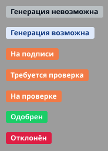
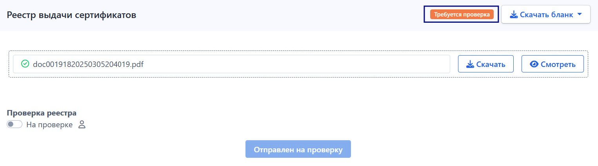
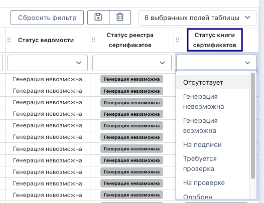

На странице экзамена ниже блока "Реестр выдачи сертификатов" есть еще один идентичный блок "Книга выдачи сертификатов".

Блок по функциям   абсолютно идентичен блоку с реестрами. Есть только два отличия: название и сам генерируемый документ.

Статусы книги выдачи могут быть следующими (аналогично реестру):

{width=184px height=257px}

Кнопка “Сгенерировать” появляется после того, как будут сгенерированы и загружены все сканы сертификатов для всех успешно сдавших экзамен граждан именно в этом экзамене. Пока загруженных сертификатов нет, статус будет “Генерация невозможна”. 

После загрузки сертификатов статус поменяется на “Генерация возможна”.

Сотрудник экзаменационной площадки  должен нажать на кнопку «Сгенерировать», чтобы появилось окно с кнопкой “Скачать бланк”. Книга перейдет в статус “На подписи”.

Скачать бланк книги можно как в формате pdf, так и в формате Excel (как и бланк реестра).

Сотрудник экзаменационной площадки  скачивает, подписывает, загружает в систему подписанный скан. Книга переходит в статус “Требуется проверка”.

{width=1525px height=424px}

Сотрудник центра тестирования  включает переключатель "На проверке» и  становится проверяющим менеджером. Книга переходит в статус “На проверке” .\
Если проверяющий менеджер назначен, то другой сотрудник центра тестирования не сможет забрать документ к себе на проверку, одобрить или отклонить.

Если проверяющий выключит переключатель, с книги снимается проверяющий менеджер и книга переходит назад в статус “Требуется проверка”.

У сотрудника центра тестирования и  отображаются кнопки “Отклонить” и “Одобрить”. При отклонении есть возможность написать комментарий с причиной.

Если книга одобрена - статус “Одобрен”, если книга отклонена - статус “Отклонен”.

На странице со списком экзаменов добавлен столбец “Статус книги выдачи”. По данному столбцу есть возможность фильтровать список и сортировать.

{width=526px height=405px}

В сгенерированный книге в столбце «Наименование документа» есть три возможных значения:\
\- Сертификат о владении русским языком, знании истории России и основ законодательства РФ на уровне, соответствующем цели получения разрешения на работу или патента,\
\- Сертификат о владении русским языком, знании истории России и основ законодательства РФ на уровне, соответствующем цели получения вида на жительство,\
\- Сертификат о владении русским языком, знании истории России и основ законодательства РФ на уровне, соответствующем цели получения разрешения на временное проживание.

Столбцы "Дата вручения", "Подпись лица, получившего документ", "Подпись рук-ля подразделения, выдавшего документ" будут оставаться пустыми для дальнейшего заполнения.
Столбцы "Дата вручения", "Подпись лица, получившего документ", "Подпись рук-ля подразделения, выдавшего документ" будут оставаться пустыми для дальнейшего заполнения.

Книга будет генерироваться по шаблону:

[КНИГА ВЫДАЧИ.xlsx](<./КНИГА ВЫДАЧИ.xlsx>)
