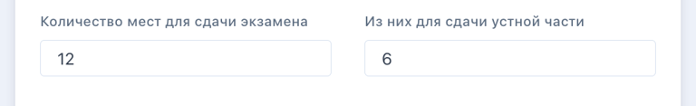
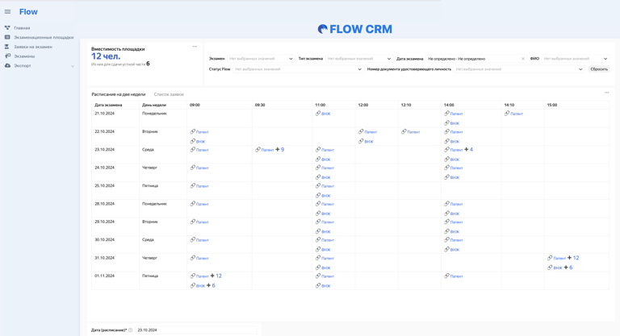
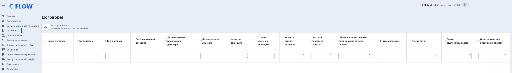

## Квота на экзамен

На странице Экзаменационной площадки во Flow можно установить квоту на одно время проведения экзамена/экзаменов (если в одно время проводятся экзамен на Патент и на РВП/ВНЖ).

:::info 

Пока установить квоту можно, обратившись в [поддержку](https://forms.yandex.ru/cloud/662cbe9243f74fea695ffa27/).

:::

Квота - это количество мест для сдачи экзамена, исходя из количества доступных в аудитории компьютеров.

{width=768px height=117px}

## Где посмотреть?

Во  Flow на главной странице есть дашборд, где на каждую дату и время экзамена в одном слоте показаны типы экзаменов:

-  клик по типу экзамена= переход на страницу экзамена во Flow

-  клик по [🔗 ](https://www.odin.study/ru/Cohort/Info/47961)= переход на страницу экзамена в Odin

-  клик по "+" = добавление сдающего на экзамен (если плюс отсутствует, значит мест для записи больше нет)

{width=768px height=417px}

## Пункт меню «Договоры»

Данные об оставшихся квотах доступны в разделе меню «Договоры».

{width=2779px height=402px}

В этом разделе также отображаются следующие столбцы с возможностью сортировки и фильтрации:\
\- номер договора,\
\- организация,\
\- вид договора,\
\- дата заключения договора,\
\- дата окончания реализации договора,\
\- дата передачи лицензии,\
\- квота по сдающим,\
\- остаток квоты по сдающим,\
\- квота по сумме договора,\
\- остаток квоты по сумме,\
\- примерное количество дней для расхода остатка квоты,\
\- статус договора,\
\- статусы актов,\
\- сумма подписанных актов,\
\- остаток квоты по подписанным Актам.

