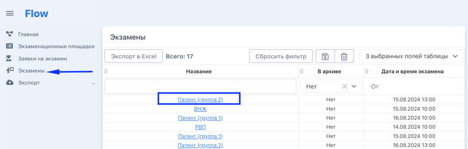
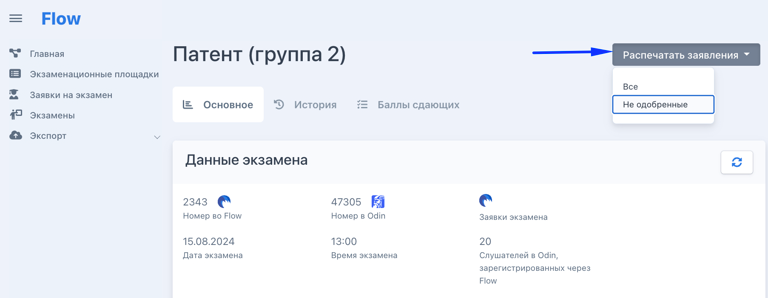
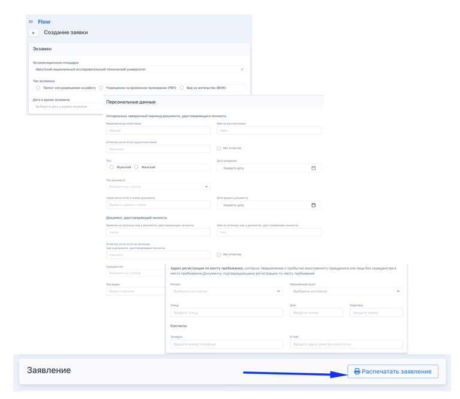
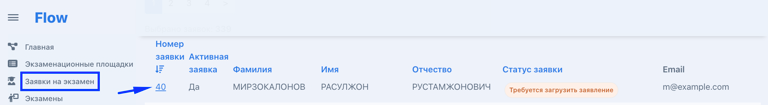
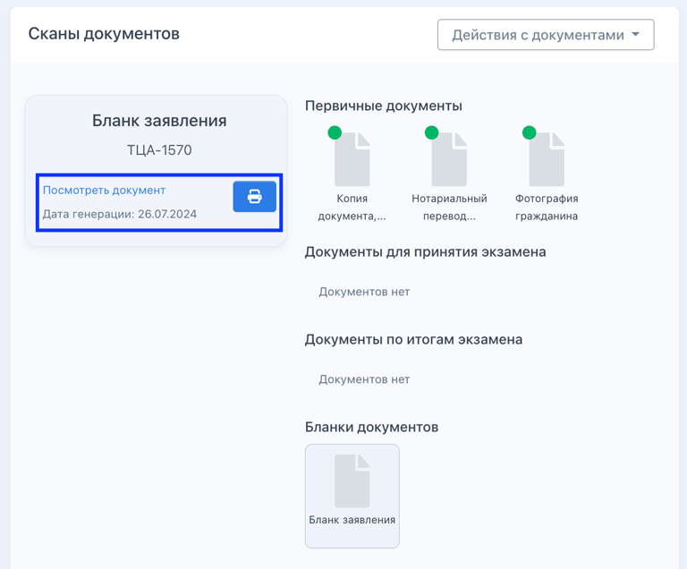
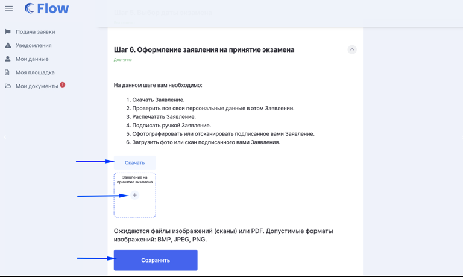
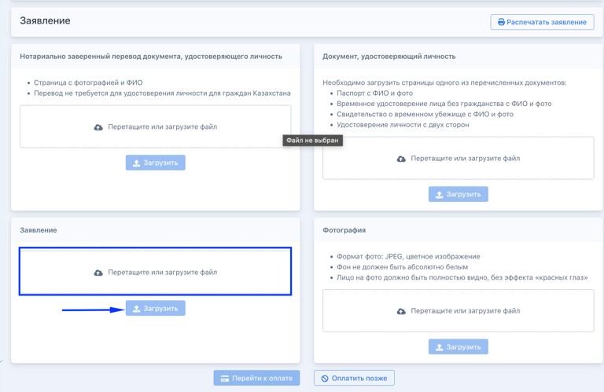
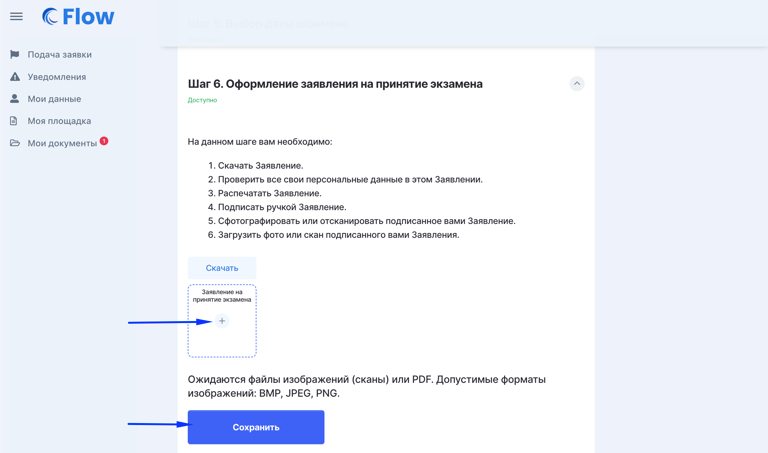

### **Распечатать бланк сгенерированного заявления**

[tabs]

[tab:Для всего экзамена]

1. Перейдите на страницу экзамена.

   {width=768px height=245px}

2. Отправьте на печать все бланки заявлений/только неодобренные бланки для сдающих выбранного экзамена.

   {width=768px height=298px}

[/tab]

[tab:При создании заявки]

1. Создайте [заявку](https://informa.gitbook.io/immigraciya/flow.-rabota-s-dokumentami/dobavlenie-zayavki-vruchnuyu)

2. Заполните блоки "Экзамен" и "Персональные данные" и "Распечатайте заявление".

   {width=768px height=666px}

[/tab]

[tab:Со страницы заявки]

1. Открыть заявку

   {width=768px height=105px}

2. В блоке "Сканы документов" найти бланк Заявления и кликнуть по нему.

   {width=768px height=611px}

3. Распечатать бланк

   {width=768px height=636px}

[/tab]

[tab:Из ЛК сдающего]

При подаче заявки электронно сдающий на шаге 6 увидет сгенерированный бланк Заявления, сможет его скачать -> распечатать -> подписать -> загрузить на проверку.

{width=768px height=459px}

[/tab]

[/tabs]

### **Загрузить подписанное заявление**

[tabs]

[tab:На странице создания]

Распечатать заявление, дать сдающему подписать, отсканировать и загрузить сразу при [создании](https://informa.gitbook.io/immigraciya/flow.-rabota-s-dokumentami/dobavlenie-zayavki-vruchnuyu) заявки.

{width=768px height=499px}

[/tab]

[tab:На странице редактирования заявки]

На странице заявки нажать кнопку "Редактировать" в блоке с "Личной информацией" и загрузить скан заявления.

{width=768px height=424px}

[/tab]

[tab:Из ЛК сдающего]

{width=768px height=453px}

[/tab]

[/tabs]