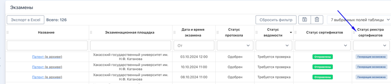
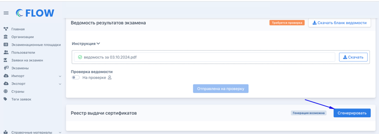
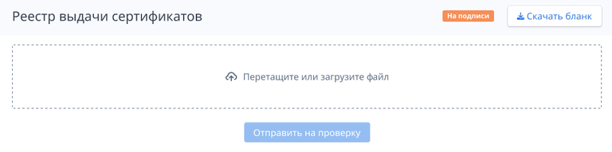
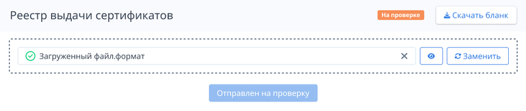
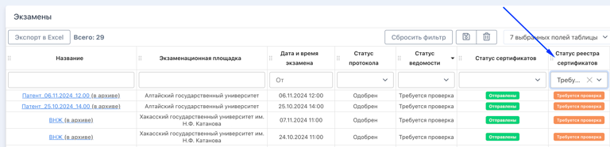

## Генерация реестра

:::info 

Реестры выдачи сертификатов - таблица, где будет указано, что человеку, сдавшему экзамен успешно,  был выдан сертификат.

:::

Генерировать сертификаты могут **сотрудники экзаменационной площадки**. Для этого необходимо:

1. Отфильтровать экзамены по столбцу "Статус реестра сертификатов" в статусе "Генерация возможна".

   {width=768px height=166px}

2. Перейти на страницу экзамена, для которого генерируется  реестр сертификатов.

3. Сгенерировать "Реестр выдачи сертификатов".

   {width=768px height=272px}

4. Скачать бланк.

   {width=768px height=191px}

5. Собрать подписи. Отсканировать реестр и отправить его на проверку.

   {width=768px height=163px}

:::note 

Кнопка "Сгенерировать" появляется после того, как будут сгенерированы и загружены все сертификаты для всех успешно сдавших экзамен граждан именно в этом экзамене. Пока загруженных сертификатов нет, статус будет "Генерация невозможна".

:::

## Проверка реестра выдачи сертификатов

Сотрудник центра тестирования:

1. открывает страницу со списком экзаменов и фильтрует экзамены по столбцу "Статус реестра сертификатов" по значению "Требуется проверка".

   {width=768px height=186px}

2. Открывает экзамен и берёт реестр на проверку.

   {width=768px height=203px}

3. Подтверждает (переход в статус Одобрен) или отклоняет (потребуется написать причину отклонения, чтобы сотрудник площадки мог исправить замечания и повторно направил реестр на проверку).

---

Реестр генерируется по следующему шаблону: [Реестр выдачи сертификатов.xlsx](<./Реестр выдачи сертификатов.xlsx>)

---

## Статусы реестра выдачи сертификатов

-  **Генерация невозможна** - в экзамене нет загруженных сканов сертификатов

-  **Генерация возможна** -  загружены все сертификаты для всех успешно сдавших экзамен граждан в этом экзамене

-  **На подписи** - сгенерирован реестр, сотрудник площадки скачал его и собирает подписи со сдающих при выдаче сертификата

-  **Требуется проверка** - сотрудник площадки загрузил подписанный реестр выдачи сертификатов и ожидает проверки сотрудника центра тестирования.

-  **На проверке** - сотрудник центра тестирования проверяет реестр.

-  **Одобрен** - реестр одобрен.

-  **Отклонен** - реестр отклонён, необходимо внести исправления и повторно отправить на проверку.