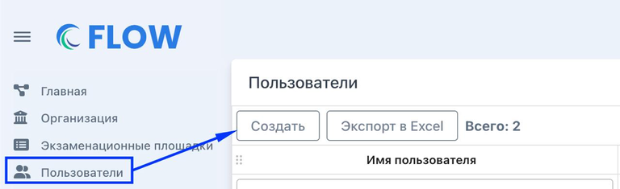
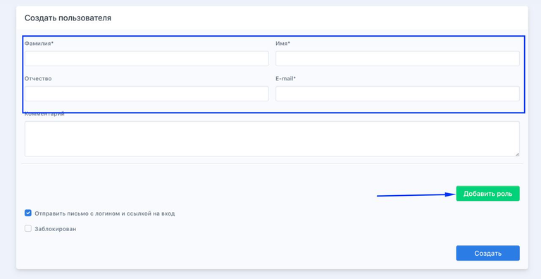
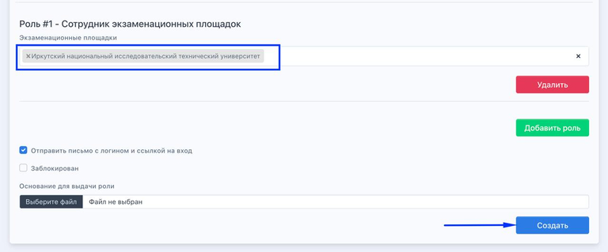

Пользователи с ролью "Сотрудник центра тестирования" смогут добавлять/блокировать учетные записи сотрудников своих организаций самостоятельно.

## Как добавить?

1. Открыть  раздел "Пользователи" и нажать кнопку "Создать"

   {width=768px height=235px}

2. Заполнить ФИО, E-mail (он должен быть уникальным для каждого пользователя) и нажать кнопку "Добавить"

   {width=768px height=396px}

3. Выбрать роль: "Сотрудник центра тестирования" (Проверяющий)/"Сотрудник экзаменационной площадки" (Работает с документами сдающих и загружает отчетные документы после экзамена)     

   {width=768px height=396px}

4.  Выбрать экзаменационную площадку или площадки , если добавляется роль "сотрудник экзаменационной площадки" или организацию для роли "сотрудник центра тестирования" и "Создать".

   {width=768px height=319px}

:::info 

Поле "Основание для выдачи роли" не обязательно для заполнения. Ранее туда добавлялись служебные записки.

:::

## Как отредактировать/заблокировать?

Для того чтобы отредактировать/заблокировать учетную запись необходимо в списке пользователей в столбце "Действия" нажать Карандашик, внести корректировки и сохранить.