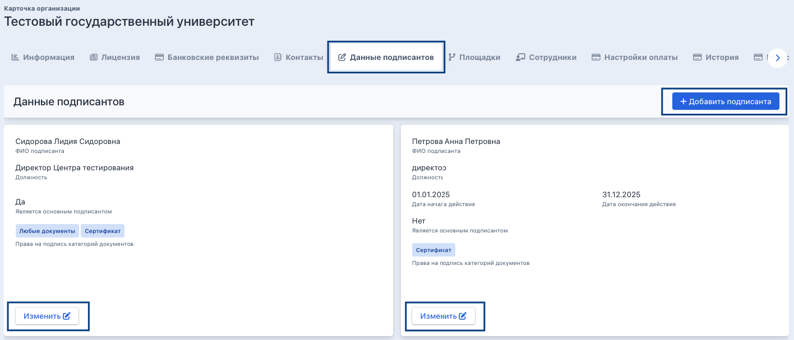
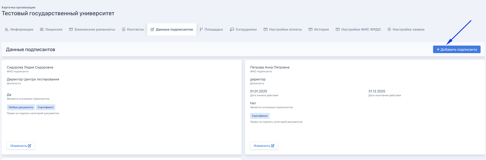
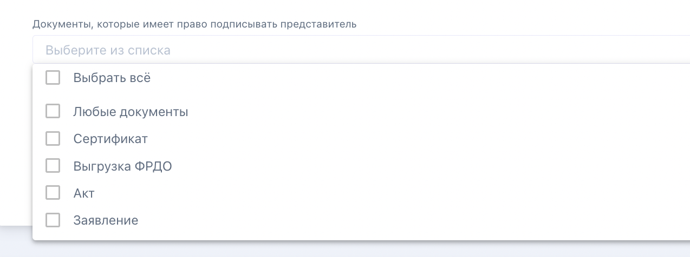
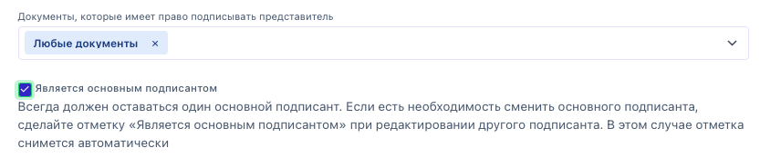
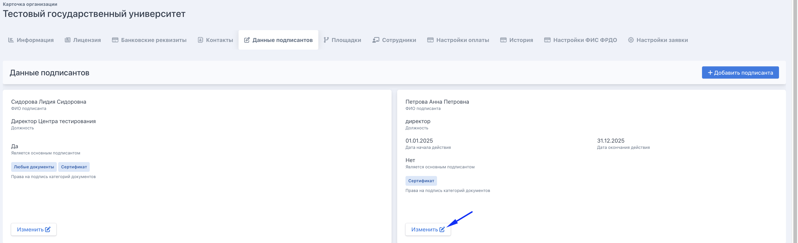

Создавать и редактировать подписантов своей организации могут сотрудники с ролью «Сотрудник центра тестирования» на странице организации на вкладке «Данные подписантов».

{width=1416px height=607px}

## Общее описание

Подписант -- это сотрудник организации, чьи данные (ФИО, должность) автоматически подставляются в документы, генерируемые системой Flow:

-  сертификаты,

-  акты,

-  заявления,

-  выгрузки ФРДО.

Управление подписантами доступно в карточке организации на вкладке **«Данные подписантов»**.

## Добавление нового подписанта

Нажмите кнопку **«+ Добавить подписанта»** в правом верхнем углу страницы.

Откроется форма «Данные подписанта» со следующими полями:

{width=3398px height=1124px}

### Данные в именительном падеже *(кто? что?)*

Эти данные используются в большинстве документов как основная форма записи.

-  **Фамилия в именительном падеже** -- например: *Иванова*

-  **Имя в именительном падеже** -- например: *Анна*

-  **Отчество в именительном падеже** -- например: *Сергеевна*

-  **Должность в именительном падеже** -- например: *Директор центра тестирования*

### Данные в дательном падеже *(кому? чему?)*

Используются в документах, где требуется форма «кому выдан».

-  **Фамилия в дательном падеже** -- например: *Ивановой*

-  **Имя в дательном падеже** -- например: *Анне*

-  **Отчество в дательном падеже** -- например: *Сергеевне*

-  **Должность в дательном падеже** -- например: *Директору центра тестирования*

### Данные в родительном падеже *(кого? чего?)*

Используются в документах, где требуется форма «подпись кого».

-  **Фамилия в родительном падеже** -- например: *Ивановой*

-  **Имя в родительном падеже** -- например: *Анны*

-  **Отчество в родительном падеже** -- например: *Сергеевны*

-  **Должность в родительном падеже** -- например: *Директора центра тестирования*

### Период действия полномочий

-  **Дата начала действия полномочий** -- дата, с которой подписант уполномочен подписывать документы.

-  **Дата окончания действия полномочий** -- дата, до которой действуют полномочия.

### Основная информация

-  **Документ, на основании которого действует представитель** *(в родительном падеже)*\
   Например: *Приказа №12 от 01.01.2026*\
   Это поле заполняется в родительном падеже (кого? чего?).

-  **Документы, которые имеет право подписывать представитель**\
   Выберите из списка одну или несколько категорий:

   -  **Любые документы** -- подписант может подписывать все типы документов

   -  **Сертификат**

   -  **Выгрузка ФРДО**

   -  **Акт**

   -  **Заявление**

{width=1274px height=476px}

-  **Является основным подписантом**\
   Отметьте галочку, если данный сотрудник является основным подписантом организации.

   :::quote 

   ⚠️ В организации всегда должен быть один основной подписант. Если необходимо сменить основного подписанта, поставьте галочку «Является основным подписантом» у нового подписанта при его редактировании -- отметка у предыдущего снимется автоматически.

   :::

{width=1714px height=448px}

После заполнения всех полей нажмите кнопку **«Сохранить»**.

---

Схема подстановки подписантов:

1. Проверяется есть ли именно в этот день подписант, у которого указан конкретный тип документа. Например, Заявление. Проверяется именно из периода действия полномочий. Если сегодня такой есть - он подставляется  в сгенерированный документ. Если такого нет в этот день - проверка идет дальше.

2. Проверяется есть ли в этот день подписант, у которого указан тип документа «Любые документы". Если сегодня такой есть - он подставляется  в сгенерированный документ. Если такого нет в этот день - проверка идет дальше.

3. Проверяется есть ли в этот день основной подписант. Если сегодня такой есть - он подставляется  в сгенерированный документ. Если такого нет - ничего не генерируется.

:::info 

**Основной подписант** попадает в генерацию в последнюю очередь.

:::

## Редактирование подписанта

На вкладке **«Данные подписантов»** найдите карточку нужного подписанта и нажмите кнопку **«Изменить»**. Внесите необходимые изменения и нажмите **«Сохранить»**.

{width=3442px height=1048px}

---

## Частые ошибки

**На странице есть незаполненные поля** -- система не сохранит подписанта, если обязательные поля не заполнены. Проверьте, что заполнены все три падежа: именительный, дательный и родительный.

**Не указан период действия полномочий** -- обязательно укажите дату начала действия полномочий. Если подписант с истёкшей датой окончания, его не будут подставляться в новые документы.

**Не выбраны документы для подписи** -- если поле «Документы, которые имеет право подписывать представитель» оставить пустым, подписант не будет использоваться ни в одном документе.

**Нет основного подписанта** -- в организации должен быть хотя бы один подписант с отметкой «Является основным подписантом». Без него часть документов не сможет быть сформирована корректно.