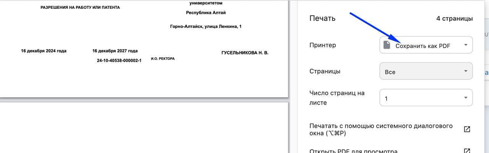

# Сертификаты


Работу с Сертификаты можно начинать только для заявок, где:

* отмечена успешная сдача экзамена
* отмечено отсутствие нарушений при сдаче
* [получен номер из ФИС ФРДО](../vygruzka-dannykh-po-shablonu-fis-frdo.md).&#x20;


Генерировать сертификаты могут только **сотрудники центра тестирования**. Для этого необходимо:

1. Отфильтровать экзамены по столбцу "Статус сертификатов" в статусе "Требуется генерация".

<figure><figcaption></figcaption></figure>

2. Перейти на страницу экзамена, для которого надо сгенерировать сертификат, выбрать вкладку "Сертификаты", нажать на "Импортировать сертификаты".

<figure><figcaption></figcaption></figure>

3. Загрузите файл с регистрационными номерами из ФИС ФРДО и нажмите "Сгенерировать".

<figure><figcaption></figcaption></figure>


Загрузить можно только один файл. После загрузки кнопка "Сгенерировать" станет активной


4. После загрузки файла и нажатия на кнопку «Сгенерировать» в таблице появляются данные о регистрационных номерах и датах.

<figure><figcaption></figcaption></figure>

Реестровый номер из файла от ФИС ФРДО - это регистрационный номер сертификата.&#x20;

## Печать сертификатов

1. Сотрудник центра тестирования распечатывает сертификаты на бланках из типографии.

<figure><figcaption></figcaption></figure>

1.1 Сохраняете в PDF (скачиваете)&#x20;

<figure><figcaption></figcaption></figure>

1.2 В настройках принтера должно быть указано А4 и вертикальное положение.

1.3 Сертификаты укладываются в принтер горизонтально

1.4 Из PDF  сертификаты печатаются на А4 в вертикальном положении

<figure><figcaption></figcaption></figure>


Перед печатью сертификатов на бланках строгой отчетности необходимо попробовать напечатать на чб-копии. То есть отсканировать реальный бланк, распечать его, обрезать ножницами поля, чтобы размер копии полностью совпадал с оригиналом и попробовать распечатать.


2. Затем сканирует сертификаты (одним файлом) и загружает во Flow.&#x20;

<figure><figcaption></figcaption></figure>

***

3. Далее потребуется несколько минут чтобы каждый скан сертификата был распознан и добавлен к соответсвующей ему заявке сдающего.

<figure><figcaption></figcaption></figure>

***

У каждой заявки на странице экзамена будет информация о  загрузке сертификата.

<figure><figcaption></figcaption></figure>

После загрузки сертификата, данные (регистрационный номер, дата выдачи, номер бланка, скан сертификата,) автоматически будут отображены в каждой заявке. Скан сертификата будет доступен в ЛК сдающего.

## Точечная загрузка сертификата со страницы заявки

После распечатки сертификата его скан можно точечно загрузить на странице каждой заявки. Подробнее познакомиться с таким способом можно [здесь](zagruzka-skana-sertifikata-v-zayavku.md).

## Статусы сертификатов

* **Не готовы к генерации** - пока все заявки экзамена не перейдут в один из статусов "Не явился на экзамен", "Неуспешно сдал экзамен", "Нарушены правила проведения экзамена", "Требуется загрузить сертификат" и не одобрен Протокол.
* **Требуется генерация** -   все заявки экзамена находятся в одном из статусов "Не явился на экзамен", "Неуспешно сдал экзамен", "Нарушены правила проведения экзамена", "Требуется загрузить сертификат"
* **Требуется загрузка** -   для всех успешных заявок сгенерированы сертификаты, но еще не загружены сканы.
* **Требуется частичная загрузка** - сертификаты загружены не для всех успешных заявок экзамена.
