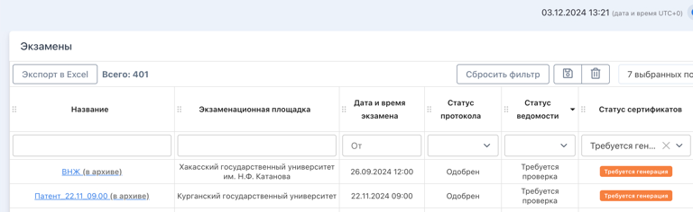
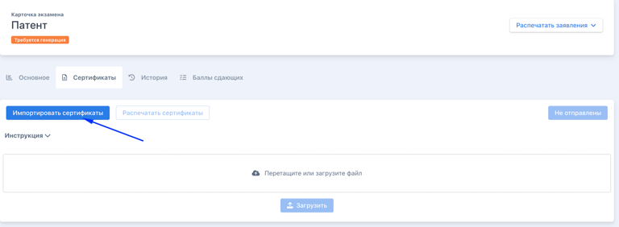
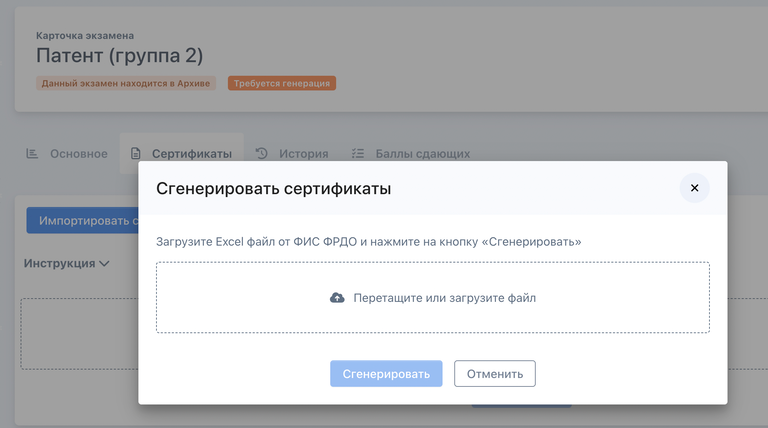
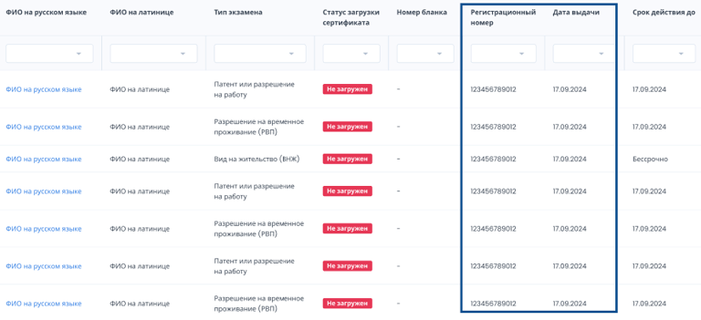
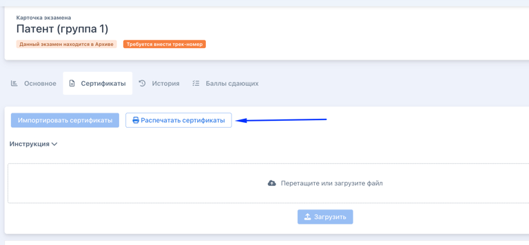
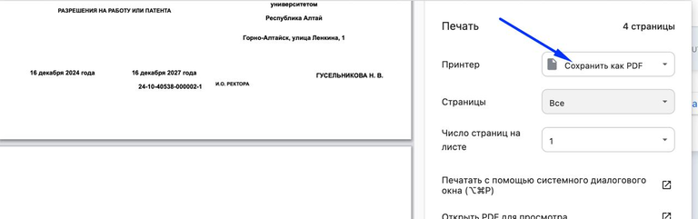
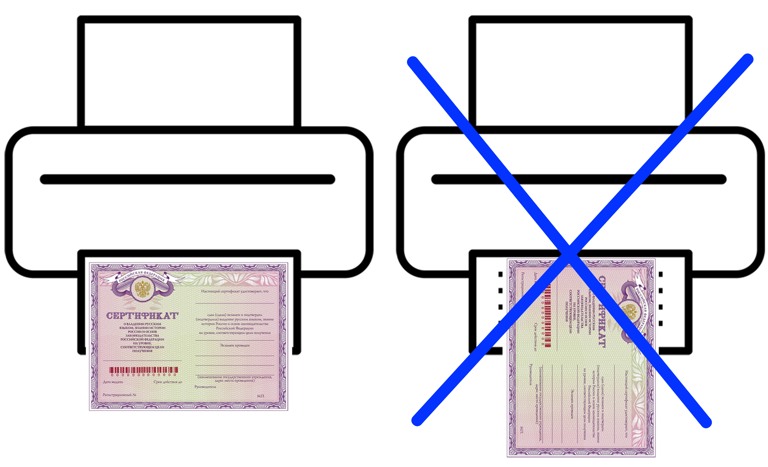
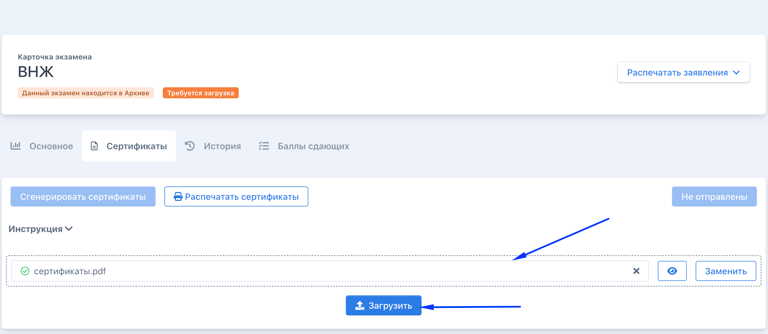
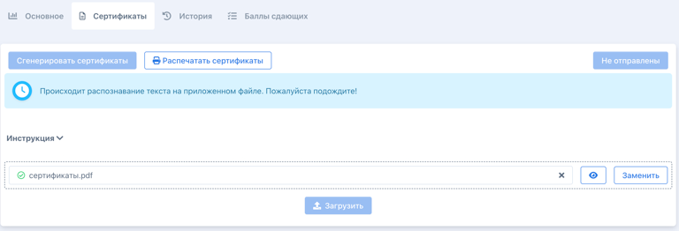
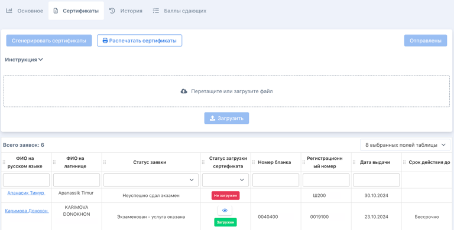

:::info 

Работу с Сертификаты можно начинать только для заявок, где:

-  отмечена успешная сдача экзамена

-  отмечено отсутствие нарушений при сдаче

-  [получен номер из ФИС ФРДО](./../vygruzka-dannykh-po-shablonu-fis-frdo).

:::

Генерировать сертификаты могут только **сотрудники центра тестирования**. Для этого необходимо:

1. Отфильтровать экзамены по столбцу "Статус сертификатов" в статусе "Требуется генерация".

   {width=768px height=236px}

2. Перейти на страницу экзамена, для которого надо сгенерировать сертификат, выбрать вкладку "Сертификаты", нажать на "Импортировать сертификаты".

   {width=768px height=282px}

3. Загрузите файл с регистрационными номерами из ФИС ФРДО и нажмите "Сгенерировать".

   {width=768px height=428px}

4. После загрузки файла и нажатия на кнопку «Сгенерировать» в таблице появляются данные о регистрационных номерах и датах.

   {width=768px height=351px}

Реестровый номер из файла от ФИС ФРДО - это регистрационный номер сертификата.

:::note 

Загрузить можно только один файл. После загрузки кнопка "Сгенерировать" станет активной

:::

## **Печать сертификатов**

1. Сотрудник центра тестирования распечатывает сертификаты на бланках из типографии.

   {width=768px height=357px}

   **1\.1** Сохраняете в PDF (скачиваете)

   {width=768px height=241px}

   **1\.2** В настройках принтера должно быть указано А4 и вертикальное положение.

   **1\.3** Сертификаты укладываются в принтер горизонтально

   **1\.4** Из PDF сертификаты печатаются на А4 в вертикальном положении

   {width=768px height=467px}

2. Затем сканирует сертификаты (одним файлом) и загружает во Flow.

   {width=768px height=334px}

3. Далее потребуется несколько минут чтобы каждый скан сертификата был распознан и добавлен к соответствующей ему заявке сдающего.

   {width=768px height=262px}

:::note 

Перед печатью сертификатов на бланках строгой отчетности необходимо попробовать напечатать на чб-копии. То есть отсканировать реальный бланк, распечатать его, обрезать ножницами поля, чтобы размер копии полностью совпадал с оригиналом и попробовать распечатать.

:::

У каждой заявки на странице экзамена будет информация о загрузке сертификата.

{width=768px height=390px}

После загрузки сертификата, данные (регистрационный номер, дата выдачи, номер бланка, скан сертификата,) автоматически будут отображены в каждой заявке. Скан сертификата будет доступен в ЛК сдающего.

### **Точечная загрузка сертификата со страницы заявки**

После распечатки сертификата его скан можно точечно загрузить на странице каждой заявки. Подробнее познакомиться с таким способом можно [здесь](https://informa.gitbook.io/immigraciya/flow.-rabota-s-dokumentami/sertifikaty/zagruzka-skana-sertifikata-v-zayavku).

### **Статусы сертификатов**

-  **Не готовы к генерации** - пока все заявки экзамена не перейдут в один из статусов "Не явился на экзамен", "Неуспешно сдал экзамен", "Нарушены правила проведения экзамена", "Требуется загрузить сертификат" и не одобрен Протокол.

-  **Требуется генерация** - все заявки экзамена находятся в одном из статусов "Не явился на экзамен", "Неуспешно сдал экзамен", "Нарушены правила проведения экзамена", "Требуется загрузить сертификат"

-  **Требуется загрузка** - для всех успешных заявок сгенерированы сертификаты, но еще не загружены сканы.

-  **Требуется частичная загрузка** - сертификаты загружены не для всех успешных заявок экзамена.