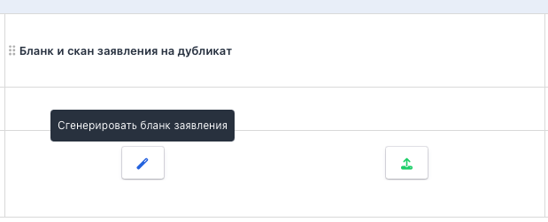

Бывают разные случаи, когда гражданину необходимо выдать дубликат сертификата. Например, неправильно были указаны ФИО в сертификате, сертификат был испорчен или утерян и т.д.

При выдаче дубликата сертификата обязательно наличие заявления от гражданина о выдаче дубликата с указанием причин. Возможны два варианта развития событий:\
\- на площадке используют свой бланк заявления или принимают эти заявления полностью написанные вручную в свободной форме. Тогда во Flow в заявку можно будет загрузить скан этого заявления.\
\- на площадке генерируется заявление, гражданин вносит в него необходимые данные от руки, подписывает, площадка сканирует и загружает сгенерированный бланк.

У одной заявки может быть несколько заявлений на дубликат и самих дубликатов.

В главное меню добавлен раздел «Дубликаты сертификатов», который изначально будет пустым.

{width=492px height=744px}

Когда сдающий обращается на площадку за получением дубликата сертификата, его заявку надо добавить в таблицу поиском по ФИО/серии и номеру документа удостоверяющего личность. В выпадающем списке отображаются только те заявки сдающего, в которых была успешная сдача экзамена. Если заявка уже была добавлена в таблицу, то она подсвечивается неактивной, при наведении на нее появляется подсказка.

{width=1784px height=950px}

Заявление на дубликат/сертификат можно как автоматически сгенерировать (и после этого перегенерировать), так и сразу загрузить имеющийся скан, который потом при необходимости можно заменить. Сгенерированные/загруженные документы появятся в блоке «Сканы документов».

:::note 

Номер сертификата необходимо получить в ФИС ФРДО самостоятельно

:::

#### Подробная инструкция по выдаче дубликата сертификата

Для того, чтобы  появилась возможность загрузить заявление на перевыпуск сертификата, необходимо создать заявку  на странице «Дубликаты сертификатов», нажав «Добавить заявку», выбрать её из списка, подтвердить выбор кнопкой «Добавить».

{width=1736px height=681px}

Заявка отобразится в списке с возможностью совершать определенные действия.

{width=2040px height=347px}

Можно как сгенерировать автоматический бланк заявления для заполнения, так и сразу загрузить готовый скан, оформленный в свободной форме.

{width=619px height=251px}

{width=610px height=240px}

При клике на кнопку генерации сформируется заявление подобного плана:

{width=845px height=1100px}

Его надо скачать, распечатать и отдать на заполнение сдающему.

После этого по кнопке «Загрузить скан заявления» загрузить скан готового заявления через дроп зону. Подтвердить загрузку кнопкой «Загрузить».

{width=852px height=607px}

Если в заявлении обнаружены ошибки, его всегда можно заменить по кнопке.

{width=323px height=111px}

После загрузки заявления становится возможна генерация бланка дубликата сертификата по соответствующей кнопке.

{width=909px height=254px}

В открывшемся окошке надо ввести регистрационный номер и дату документа.

{width=794px height=352px}

После генерации бланка, его надо распечатать на официальном бланке, а затем загрузить в систему скан по кнопке «Загрузить скан дубликата сертификата».

{width=637px height=249px}

Загруженный скан дубликата сертификата можно заменить по кнопке, если вдруг документ загружен ошибочно.

{width=771px height=241px}