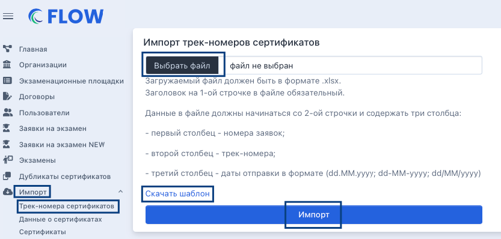

В системе доступен раздел «Импорт». Существуют следующие виды импорта:

[tabs]

[tab:Трек-номера сертификатов]

Для такого вида импорта необходимо выбрать пункт меню «Импорт» - «Трек-номера сертификатов». Далее скачать шаблон, заполнить его по инструкции, загрузить полученный файл в дроп-зону по кнопке «Выбрать файл» и нажать на «Импорт».

{width=846px height=410px}

[/tab]

[tab:Данные о сертификатах]

Для такого вида импорта необходимо выбрать пункт меню «Импорт» - «Данные о сертификатах». Далее скачать шаблон, заполнить его по инструкции, загрузить полученный файл в дроп-зону по кнопке «Выбрать файл» и нажать на «Импорт».

{width=933px height=547px}

[/tab]

[tab:Сертификаты]

Для такого вида импорта необходимо выбрать пункт меню «Импорт» - «Сертификаты». Далее ознакомиться с примером zip-архива, где каждый сертификат должен быть в отдельном файле формата PDF, а названия файлов сертификатов должны быть номерами заявок сдающих. Создать zip-архив на своем компьютере, по кнопке «Выбрать файл» загрузить его в дроп-зону, далее нажать на «Импорт». 

{width=825px height=412px}

-  Чтобы создать zip-архив в Windows, щелкните правой кнопкой мыши файл или папку, выберите "Отправить", а затем "Сжатая zip-папка". В результате в том же расположении появится новая zip-папка с тем же именем, которую можно будет переименовать при необходимости.

-  Чтобы создать zip-архив на Mac, выделите нужные файлы или папки в Finder, нажмите на них правой кнопкой мыши (или удерживая клавишу Control) и выберите «Сжать» в появившемся контекстном меню. В той же папке появится новый файл с расширением .zip.

[/tab]

[tab]

[/tab]

[/tabs]

