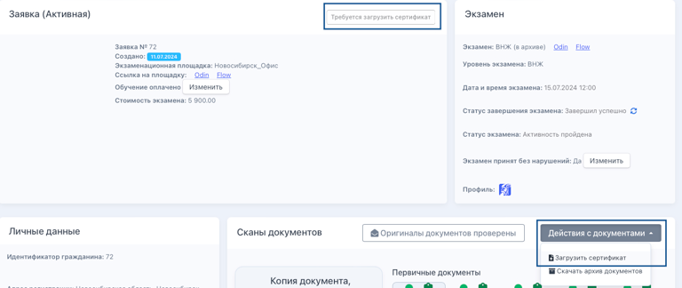
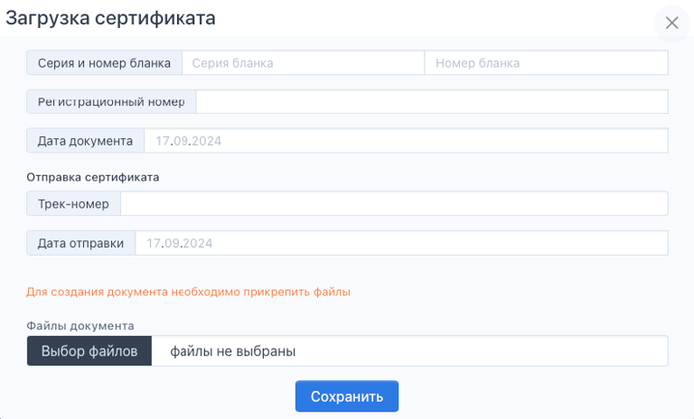
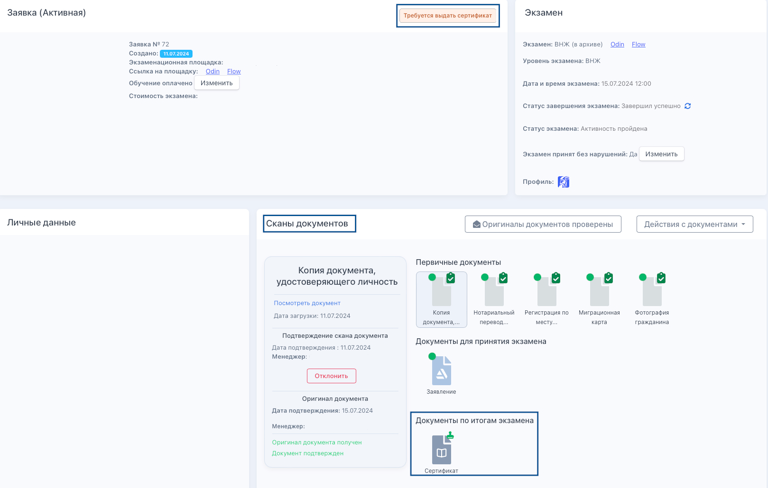
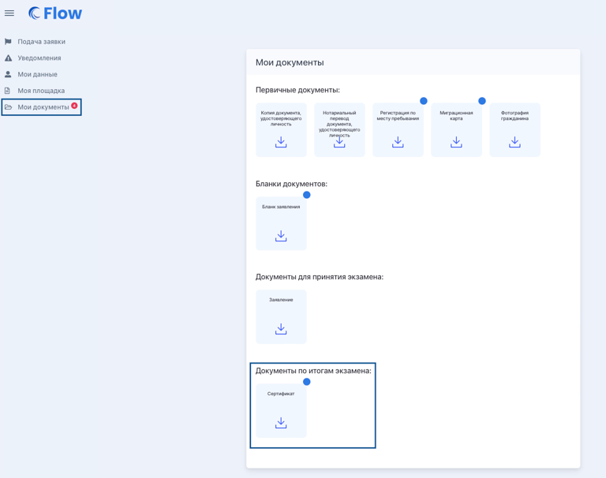

В случае успешной сдачи экзамена выдаётся сертификат.

Загрузить сертификат во Flow должен сотрудник головного "Центра тестирования". Для этого необходимо:

-  отфильтровать заявки по статусу  "Требуется загрузить сертификат"

-  на странице заявки нажать кнопку "Действия с документами", выбрать "Загрузить сертификат".

   {width=768px height=324px}

Далее откроется всплывающее окно, в котором надо будет заполнить всю необходимую информацию (серию и номер бланка, регистрационный номер, дата документа, трек-номер, дата отправки), а также прикрепить файл документа сертификата. Нажать на "Сохранить".

{width=768px height=464px}

После успешного прикрепления сертификата заявка  перейдет в статус "Требуется выдать сертификат", а сам сертификат отобразится в блоке Сканы документов.

{width=768px height=488px}

Сдающий сможет посмотреть скан документа  в личном кабинете в блоке "Мои документы".

{width=768px height=606px}