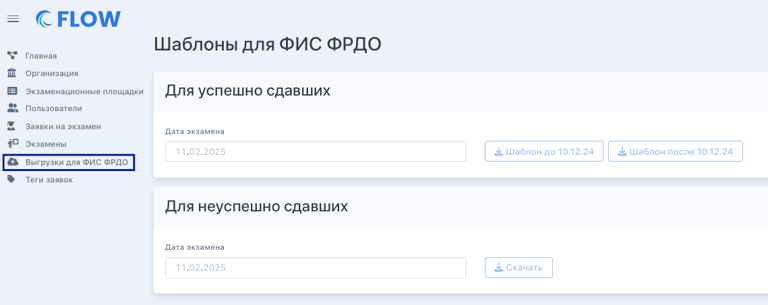

Выгрузку данных для ФИС ФРДО следует выполнить следующим образом.

1. Откройте "Экспорт" в левом боковом меню

2. Выберите "Шаблоны для ФИС ФРДО".

3. Выставите дату экзамена, для которого необходима выгрузка

4. Выберите шаблон после 10.12.24.

   {width=768px height=305px}

:::info 

Подписант для ФИС ФРДО подставляется из подписантов, указанных в организации. Этот же подписант должен быть у организации зарегистрированы в системе ФИС ФРДО. \
Если при скачивании шаблона обнаружены ошибки, необходимо обратиться в [техническую поддержку](https://forms.yandex.ru/cloud/662cbe9243f74fea695ffa27/).

:::

Типы сертификатов в выгрузке:

-  Сертификат о владении русским языком, знании истории России и основ законодательства Российской Федерации на уровне, соответствующем цели получения разрешения на временное проживание,

-  Сертификат о владении русским языком, знании истории России и основ законодательства Российской Федерации на уровне, соответствующем цели получения вида на жительство,

-  Сертификат о владении русским языком, знании истории России и основ законодательства Российской Федерации на уровне, соответствующем цели получения разрешения на работу или патента.

:::info 

Файл импорта будет содержать не более 105 строк и строго 1 лист. Размер файла: .xlsx - 200KB, .csv - 500KB.

:::

Можно настроить массовую печать сертификатов по выгрузке. Правила заполнения шаблона доступны в файле.

[Инструкция\_импорт\_групповой\_ввод.pdf](./%D0%98%D0%BD%D1%81%D1%82%D1%80%D1%83%D0%BA%D1%86%D0%B8%D1%8F_%D0%B8%D0%BC%D0%BF%D0%BE%D1%80%D1%82_%D0%B3%D1%80%D1%83%D0%BF%D0%BF%D0%BE%D0%B2%D0%BE%D0%B9_%D0%B2%D0%B2%D0%BE%D0%B4.pdf)