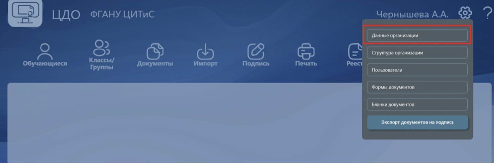
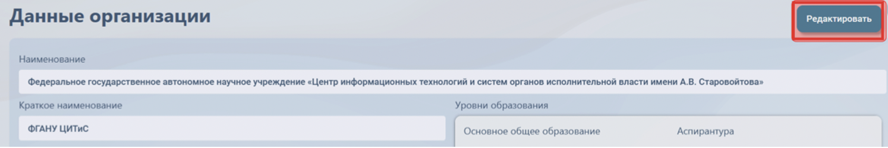
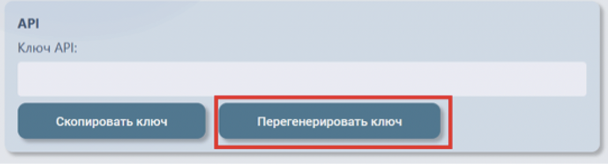
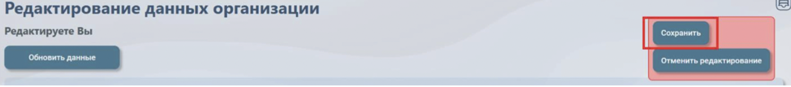
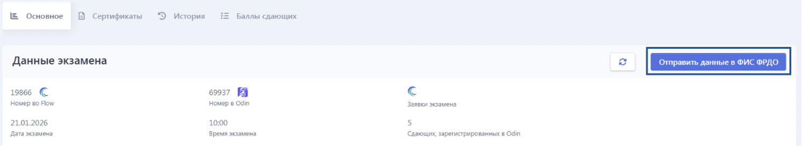
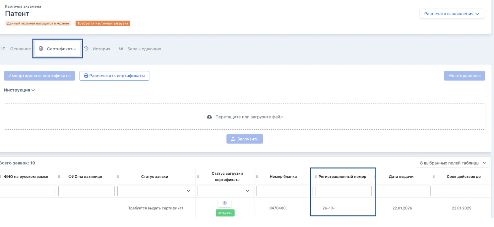
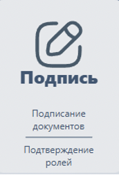

Реализована отправка сертификатов со страницы экзамена. Для осуществления отправки необходимо сгенерировать Ключ API и передать его в техническую поддержку Flow.

**Генерация ключа API**

Код доступа (ключ API) генерируется ответственным за настройку личного кабинета организации самостоятельно в кабинете организации в разделе «Данные организации» (<https://mycdo.obrnadzor.gov.ru/org>). Для генерации ключа пользователю с функцией конфигурирование необходимо:

1) перейти в раздел «Данные организации»

{width=1488px height=494px}

2) нажать на кнопку «Редактировать»

{width=1494px height=250px}

3) пролистать страницу вниз, нажать на кнопку «Перегенерировать ключ», подтвердить действие в открывшемся окне

{width=1298px height=354px}

4) после генерации ключа обязательно выполнить нажать на кнопку «Сохранить». Ключ доступа готов к использованию.

{width=1490px height=166px}

Примечание. Одновременно может использоваться только один код доступа, генерация нового кода автоматически прекращает действие предыдущего (генерация нового ключа доступа в основной организации не прекращает действие ключа доступа в элементе структуре организации, и наоборот).

**Передача ключа API**

После генерации ключа его необходимо передать в техническую поддержку Flow через обращение <https://forms.yandex.ru/cloud/662cbe9243f74fea695ffa27/>, выбрав пункт “в техподдержку”.

**Отправка данных в ФИС ФРДО**

На странице экзамена после его завершения есть кнопка "Отправить данные в ФИС ФРДО" (отображается только в том случае, если у организации заполнены данные для доступа по API). После клика кнопка "Отправить данные в ФИС ФРДО" становится неактивной, повторная отправка будет возможна только в том случае, если статусы каких-либо заявок изменятся и они должны будут получить сертификат.

{width=1494px height=278px}

После выбора подписанта в модальном окне происходит отправка заявок. Когда данные отправлены в ФИС ФРДО, в системе Flow появляются регистрационные номера у заявок, которые были отправлены.

{width=1490px height=686px}

Далее сотруднику организации надо подписать сертификат на вкладке "Подпись" в ФИС ФРДО.

{width=172px height=252px}

После подписания заявок в ФИС ФРДО на странице заявки генерируется бланк сертификата.