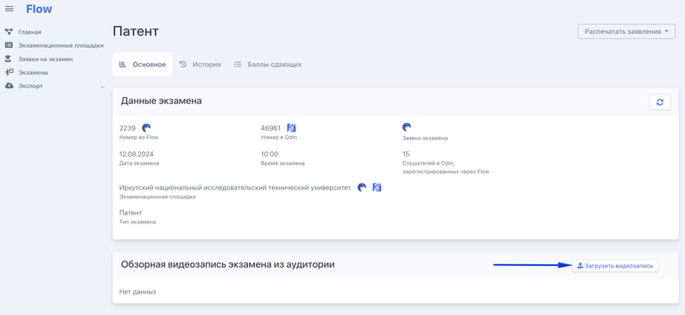
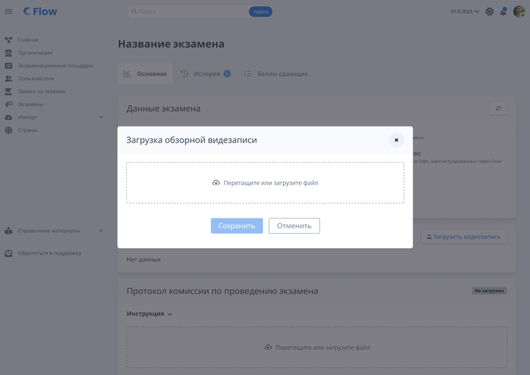
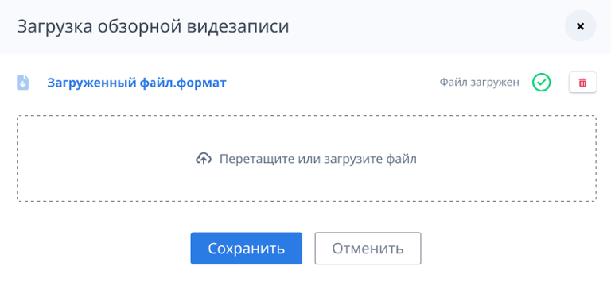

{width=768px height=354px}

Для этого надо нажать на кнопку «Загрузить видеозапись», после чего откроется модальное окно с загрузкой.

{width=768px height=544px}

Надо выбрать и загрузить файл/файлы. После загрузки нажать "Сохранить".

{width=768px height=369px}

После сохранения файлы будут доступны в карточке экзамена с возможностью удаления.

{width=703px height=122px}

Если после сохранения нажать повторно кнопку «Загрузить видеозапись», то в модальном окне остаются все ранее сохраненные файлы с полем загрузки. После внесения любых изменений (удаление файла или загрузка нового) кнопка «Сохранить» становится активной. Загружать можно только файлы с форматом видео.