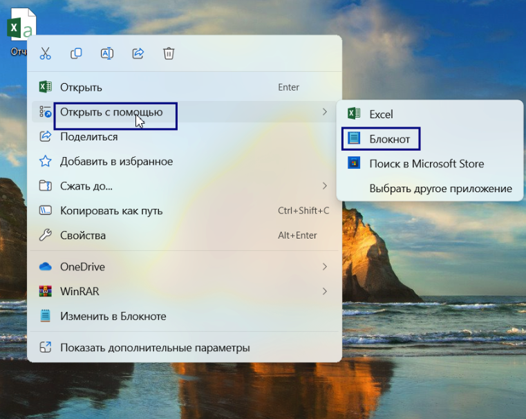
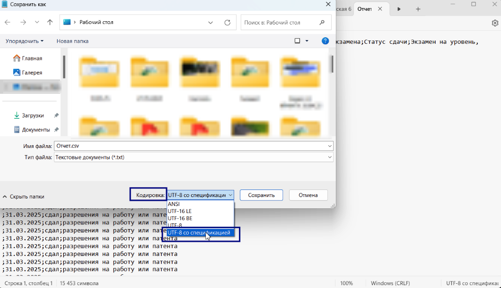

Для загрузки[ еженедельного отчета для Министерства науки и высшего образования РФ](https://informa.gitbook.io/otchet-dlya-minobrnauki-rf) требуется CSV UTF-8(разделители-запятые).

{width=529px height=585px}

Если на компьютере установлена версия Microsoft Office ранее 2019, то данная кодировка (CSV UTF-8 (разделители-запятые)) отсутствует. Для приведения файла к верному формату необходимо:

1. Найти файл с отчетом в формате CSV на вашем компьютере.

2. Щелкнуть правой кнопкой мыши на файле и выбрать "Открыть с помощью" --> "Блокнот".

   {width=761px height=606px}

3. В Блокноте перейти в меню "Файл" и выбрать "Сохранить как...".

   {width=1068px height=608px}

4. В открывшемся окне выбрать "Кодировка" и установите значение "UTF-8 с спецификацией".

   {width=1059px height=611px}

5. В поле "Имя файла" добавить в конце название файла ".csv" (например, "отчет.csv").

6. Нажать "Сохранить".