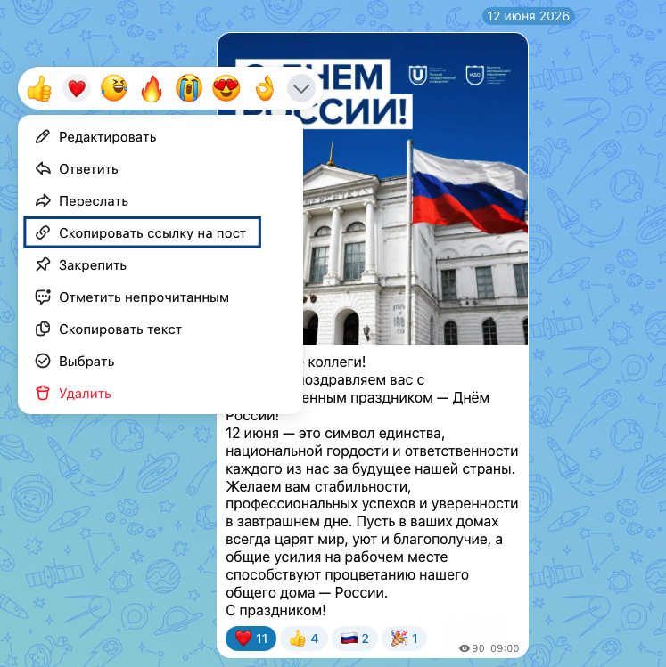
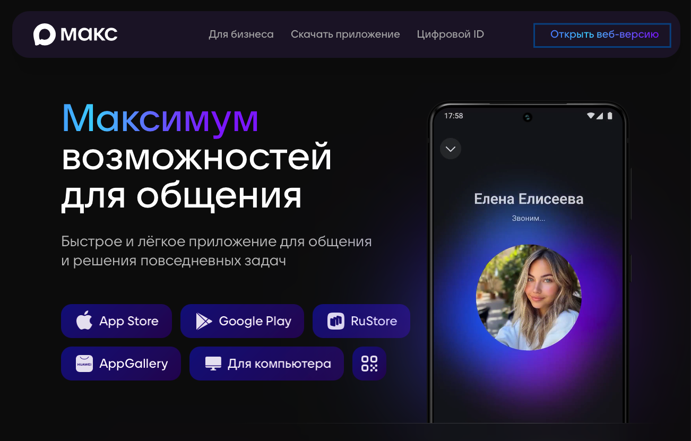
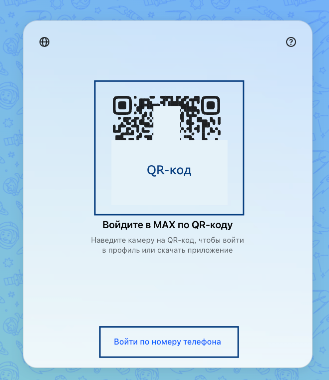
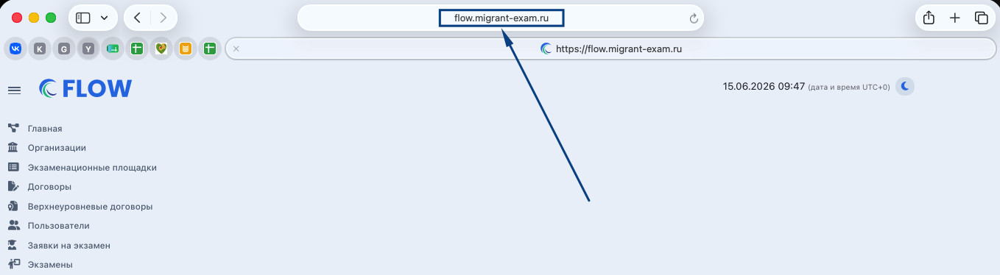
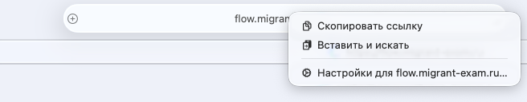
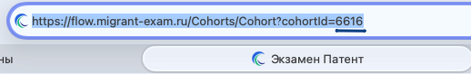

**Вопрос:** Как скопировать ссылку на сообщение в МАКС?

**Ответ:** Необходимо выбрать сообщение, ссылку на которое надо скопировать, кликнуть по нему правой кнопкой мыши, нажать «Скопировать ссылку на пост». Если делаете это с мобильного устройства, необходимо зажать пальцем сообщение, появится аналогичное меню.

{width=747px height=749px}

\___________________________________________________________________________________________\_

**Вопрос:** Как установить десктопную версию МАКС? (версию для компьютера)

**Ответ:** Надо зайти на официальный сайт  <https://max.ru>, нажать на «Открыть веб-версию». 

{width=1302px height=831px}

Далее появится QR-код, который надо отсканировать телефоном, на котором уже установлен МАКС с Вашей учетной записью. Либо можно пойти по номеру телефона (кнопка расположена снизу QR-кода). 

{width=659px height=761px}

После входа все чаты откроются на компьютере/ноутбуке прямо в браузере.

\___________________________________________________________________________________________\_

**Вопрос:** Что такое адресная строка? 

**Ответ:** В адресной строке браузера находится ссылка на ту страницу, где Вы сейчас находитесь. Она расположена вверху окна браузера.

{width=1358px height=374px}

Если кликнуть по этой ссылке правой кнопкой мыши, то ее можно скопировать и отправить коллеге или в поддержку.

{width=656px height=128px}

 

 \___________________________________________________________________________________________\_

**Вопрос:** Что такое идентификатор и где его найти?

**Ответ:** Идентификатор - это номер заявки или экзамена. Для запроса в техподдержку достаточно направить только этот идентификатор заявки/экзамена и описать проблему, которая требует проверки/помощи. Найти этот идентификатор можно в адресной строке в конце ссылки на заявку или экзамен. Эти цифры и будут идентификатором. Например:

{width=518px height=82px}

 

 