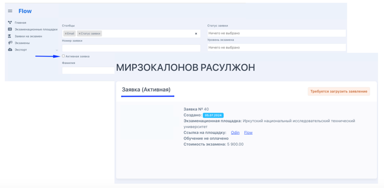

Активная заявка - последняя созданная/поданная заявка.

Во Flow фиксируются все заявки по каждому, кто сдавал или записывался на экзамен. Администратор сможет работать только с активной заявкой человека.

{width=768px height=376px}