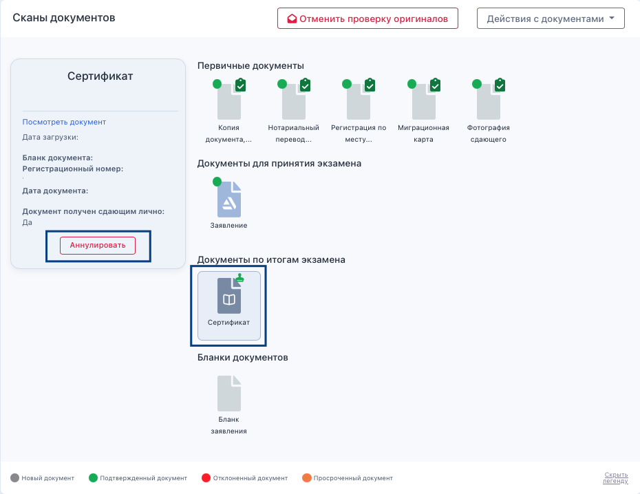
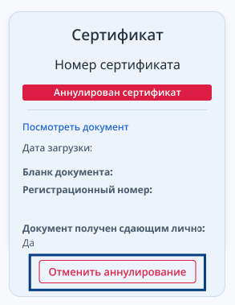
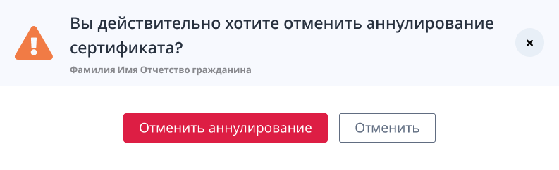

Бывают случаи, когда уже выданный гражданину сертификат надо аннулировать. \
Для этого необходимо зайти на страницу заявки, выделить сертификат в блоке "Сканы". В блоке сертификата будет отображаться кнопка «Аннулировать». 

{width=930px height=718px}

Кнопка "Аннулировать" доступна пользователям с ролями "Сотрудник центра тестирования", "Сотрудник экзаменационной площадки».

При клике на кнопку должно отобразиться окно, в котором:

-  необходимо обязательно ввести комментарий с причинами аннулирования

-  можно загрузить какой-то документ в формате pdf (это например, может быть протокол  комиссии или решение суда или еще что-то). Загруженный будет отображаться в блоке "Сканы документов" в разделе "Документы по итогам экзамена" рядом с сертификатом, возможность редактирования будет доступна.

Заявка перейдет в  статус "Аннулирован сертификат". Состояние заявки в этом статусе  точно такое же, как и у заявки в статусе "Экзаменован - услуга оказана", только с другой пометкой.

В ЛК сдающего не останется возможности скачать сертификат. Будет отображаться надпись, что сертификат аннулирован и адрес, куда можно обратиться с вопросом. В качестве адреса указывается адрес места выдачи сертификата.

После аннулирования кнопка «Аннулировать» переименуется в "Отменить аннулирование».

{width=293px height=379px}

Клик на эту кнопку вызывает модальное окно с вопросом "Вы действительно хотите отменить аннулирование сертификата?».

{width=793px height=242px}

Кнопка "Отменить аннулирование" также  доступна пользователям с ролями "Сотрудник центра тестирования", "Сотрудник экзаменационной площадки».

Если аннулирование отменено, то статус заявки возвращается из "Аннулирован сертификат" в актуальный статус.