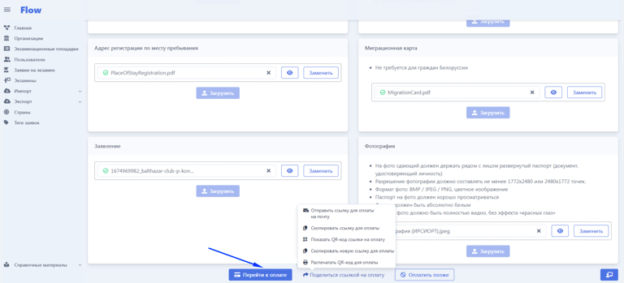

На странице создания/редактирования заявки необходимо нажать на кнопку "Поделиться ссылкой на оплату".

При клике откроется выпадающий список, где можно выбрать способ:

-  отправить ссылку для оплаты на почту (письмо со ссылкой на оплату будет направлено на указанную в заявке почту),

-  скопировать ссылку для оплаты,

-  показать QR  для оплаты,

-  распечатать qr-код для оплаты (если на площадке оплаты принимают по qr-коду, который оплачивается через банкомат, без использования подключенного эквайринга, то будет только данный пункт).

{width=768px height=349px}