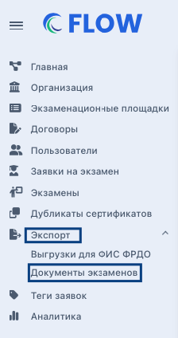
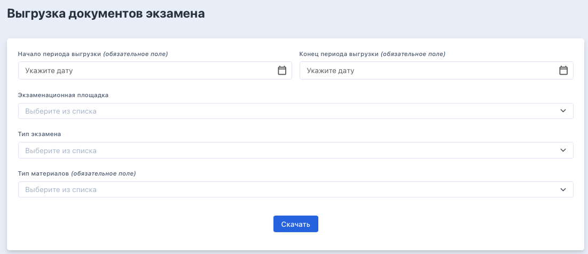
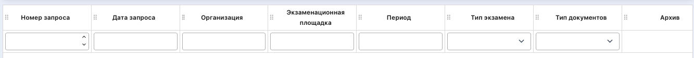
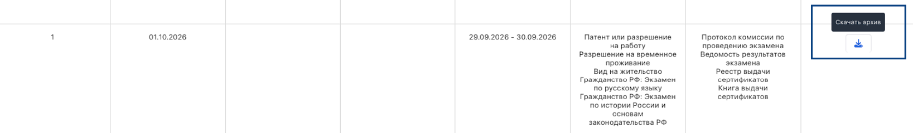

В бесшовной среде  Odin + Flow реализована возможность добавить аудитора для проверки данных по экзаменам. Подробнее о возможностях проверки аудитора [здесь](https://www.flow-crm.study/flowimaudithelp). Но центры тестирования поделились информацией, что бывают случаи, когда аудитора назначить не получается (например, проверяющий не готов проходить регистрацию). Для таких случаев в системе появилась возможность скачать документы по экзаменам массово.

В основном меню есть раздел «Экспорт", подраздел "Документы экзаменов» (доступно сотрудникам центров тестирования и аудиторам).

{width=224px height=424px}

Открывается страница "Выгрузка документов экзамена» для ввода следующих данных:

-  начало периода и конец периода выгрузки. Можно выбрать период максимум в один год.

-  после "Экзаменационная площадка".

-  поле "Тип экзамена". В выпадающем списке показываются все типы экзаменов с чек-боксами: патент, РВП, ВНЖ, гражданство (русский язык) и гражданство (история и законодательство). Можно выбрать сразу все значения одним кликом.

-  под полями надо выбрать типы материалов, которые надо выгрузить: "Видеозапись экзамена из аудитории", "Протокол комиссии по проведению экзамена", "Ведомость результатов экзамена", "Реестр выдачи сертификатов" и "Книга выдачи сертификатов". Можно выбрать один или несколько.

{width=1101px height=476px}

Под блоком с настройками скачиваемого архива размещена таблица со столбцами:

-  Номер запроса

-  Дата запроса

-  Организация

-  Экзаменационная площадка

-  Период

-  Типы экзаменов.

-  Типы документов.

-  Архив. Когда запущено формирование архива, в столбце показывается спиннер и текст "Архив формируется". Если срок хранения архива не истек, то показывается кнопка скачивания архива. Если архив уже удален, то показывается текст "Срок хранения архива истек".

{width=1333px height=112px}

Клик по кнопке "Скачать" после заполнения формы добавляет новую строку в таблицу, в которой отображаются выбранные параметры в соответствующих столбцах.

У пользователя есть возможность заказать одновременно до 5 архивов. Пока очередь не уменьшится хотя бы до 4, нельзя создавать новые.

По итогам запроса около нескольких минут формируется архив с документами с названием "Документы экзаменов \<выбранный период>». Внутри архива размещается папка/папки с названием экзаменационной площадки, далее папка/папки с названием типа экзамена, затем папки с датой и ID экзамена, по примеру именования протокола - "06.08.2026\_ 12345". Внутри папки размещаются отдельными файлами выбранные пользователем документы экзамена с сохранением имен, как если бы они выгружались на странице экзамена. Отдельной папкой отображаются видео.

{width=1637px height=240px}

Сформированный архив хранится ровно 7 суток.