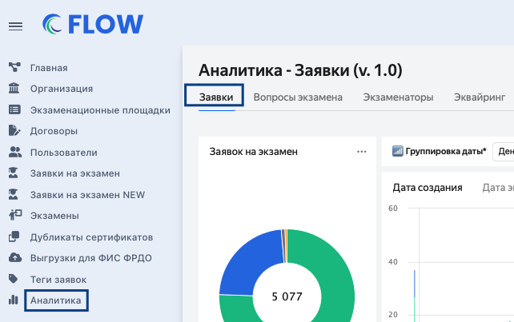
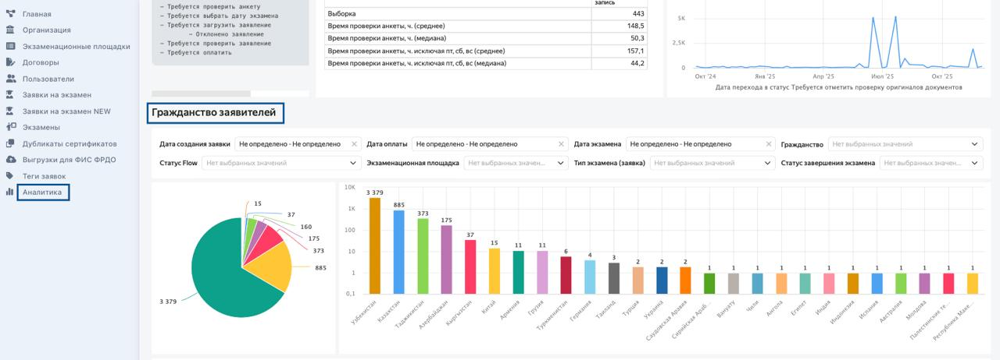

Для отслеживания статистики по гражданству в системе есть специальный дашборд «Гражданство заявителей». Чтобы его просмотреть, надо зайти в раздел «Аналитика», выбрать вкладку «Заявки».

{width=642px height=403px}

И далее пролистать страницу вниз до дашборда.

{width=1280px height=462px}

