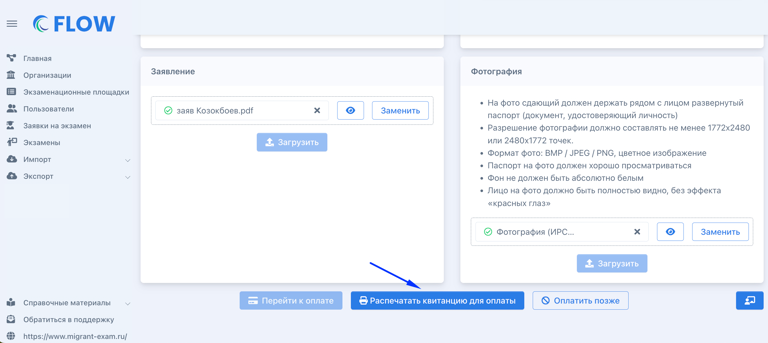
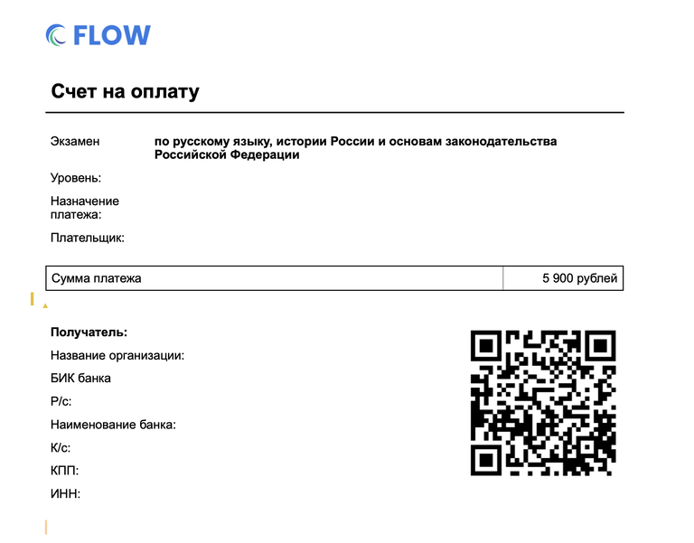

При создании/редактировании заявки по кнопке "Распечатать QR-код" для организаций, где включена генерация QR-кода, появится возможность распечатать квитанцию c QR-кодом.

{width=768px height=343px}

Квитанция с QR-кодом будет содержать информацию об [организации](./../../flow.-rabota-s-dokumentami/organizaciya), сумма будет выставлена в соответствии с уровнем сдаваемого экзамена. С этой квитанцией иностранный гражданин  должен будет сходить к банкомату или платёжному терминалу, произвести оплату и принести чек об оплате на площадку.

{width=768px height=601px}

Далее сотрудник площадки [выставляет факт](./kak-vruchnuyu-postavit-oplatu-po-zayavke) [оплаты](./kak-vruchnuyu-postavit-oplatu-po-zayavke) в заявке.