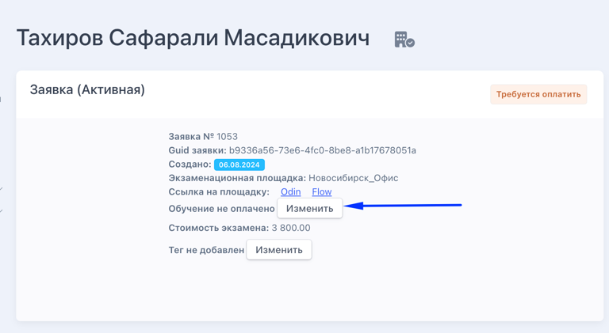
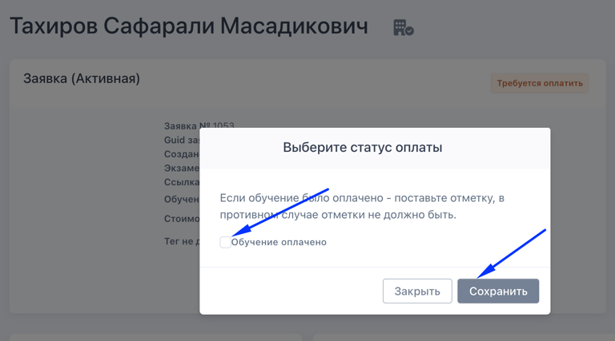
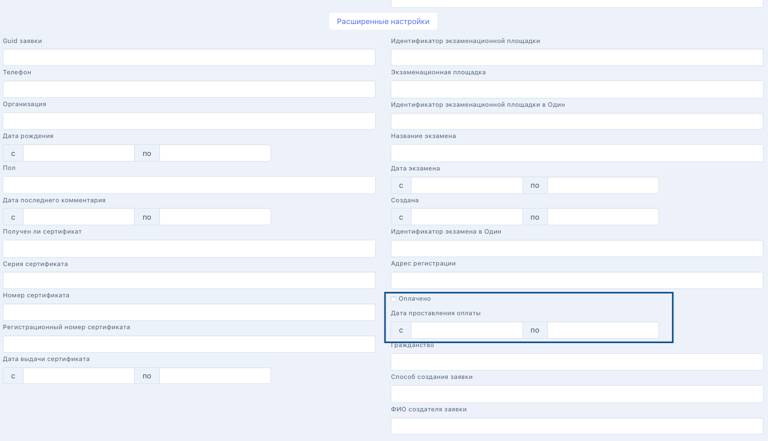

После получения информации о том, что экзамен оплачен. Например, человек оплатил с использованием выданного qr-кода или организация провела платёж за нескольких сотрудников, сотрудник экзаменационной площадки должен:

1. Перейти на страницу заявки

2. В блоке "Заявка" нажать на кнопку "Изменить"

   {width=768px height=421px}

3. Поставить галочку "Оплачено" и нажать "Сохранить"

   {width=768px height=427px}

В списке заявок есть фильтр "Дата проставления оплаты", а также фильтр непосредственно по факту оплаты. Столбец с датой проставления оплаты выгружается в Excel.

{width=768px height=441px}