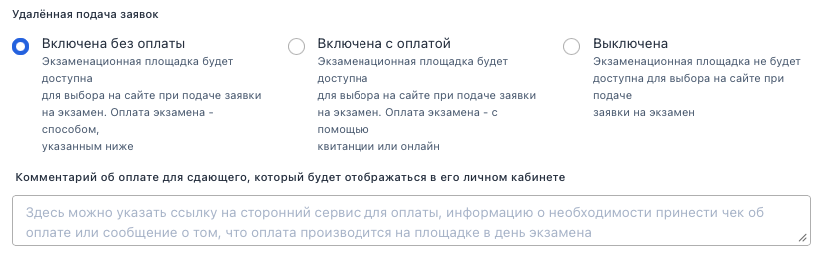
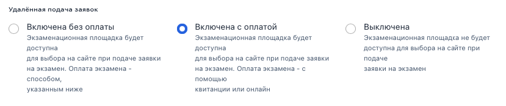
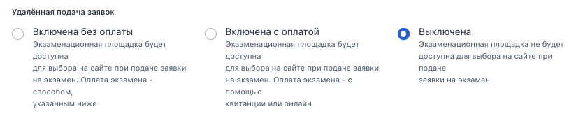

На странице экзаменационной площадки есть настройки включения удаленной подачи заявки с разными формами оплаты (выбор доступен через техническую поддержку):

-  «Включена без оплаты»

   {width=833px height=262px}

-  «Включена с оплатой»

-  {width=829px height=175px}

-  «Выключена»

   {width=824px height=176px}

При выборе варианта «Включена без оплаты» в редактировании площадки будет отображаться поле "Комментарий об оплате для сдающего, который будет отображаться в его личном кабинете".\
В этом поле площадка добавляет текст, в котором могут быть ссылки на сторонние ресурсы, где может проходить оплата или, например, информация о том, что человек должен принести с собой чек. Либо можно разместить текст о том, что оплата производится непосредственно на площадке в день экзамена.\
Комментарий может быть длинным, данное поле  обязательно для заполнения.\
Заполненное данное поле должно отображаться и в режиме чтения на странице площадки.

