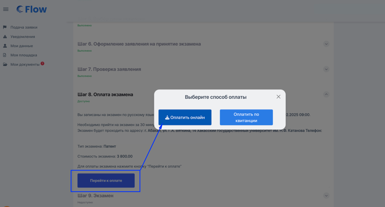
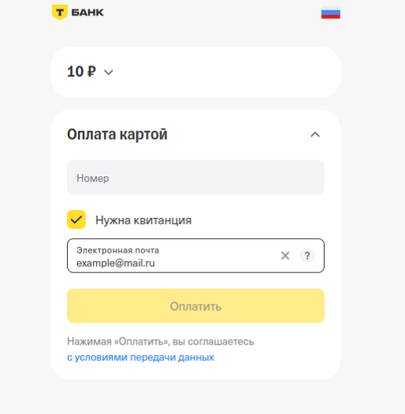

В личном кабинете сдающего  при использовании эквайринга по [схеме маркетплейса](./_index) будет кнопка "Оплатить онлайн" (кнопка "Оплатить по квитанции" - это  оплата по qr-коду, такой способ оплаты можно отключить по запросу в техподдержку).

{width=768px height=413px}

После нажатия на кнопку "Оплатить онлайн" откроется форма для ввода данных карты.

{width=514px height=526px}

:::info 

При оплате допускается использовать только карты российских банков.

:::