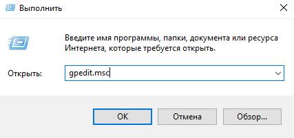
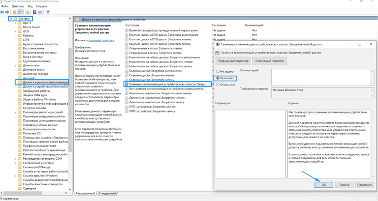

Для этого необходимо:

1. Открыть редактор групповых политик, нажмите *win* + R, ввести команду "gpedit.msc" или воспользоваться поиском Windows.

   {width=427px height=201px}

2. В окне редактора групповых политик перейти по следующему пути:

   ```
   Конфигурация компьютера \ Административные шаблоны \ Система \ Доступ к съемным запоминающим устройствам
   ```

3. Поменять значение пункта "Съемные запоминающие устройства всех классов: Запретить любой доступ" на "Включено".

   {width=768px height=409px}

4. После всего необходимо перезагрузить компьютер. При попытке вставить флеш-накопитель в usb-разъем высветится ошибка.

