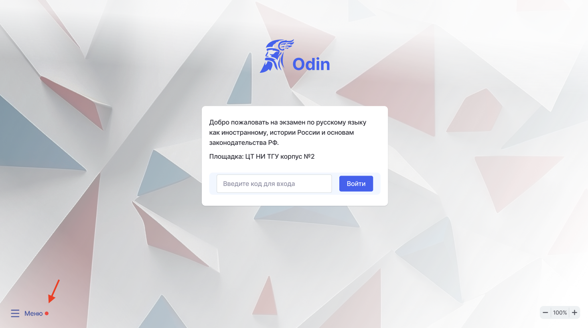
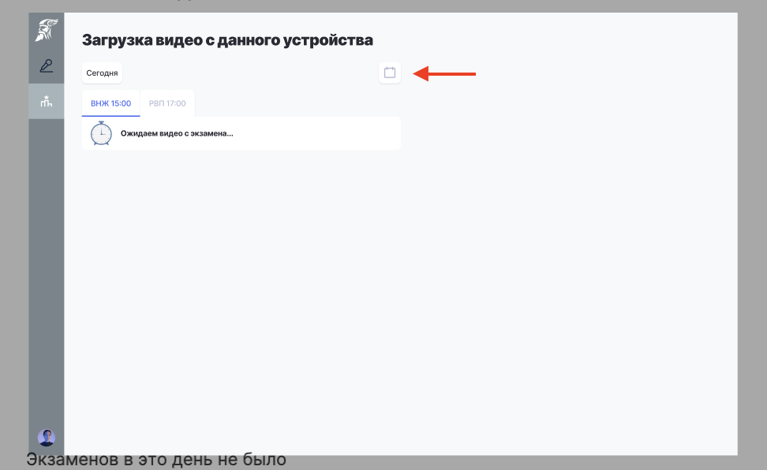
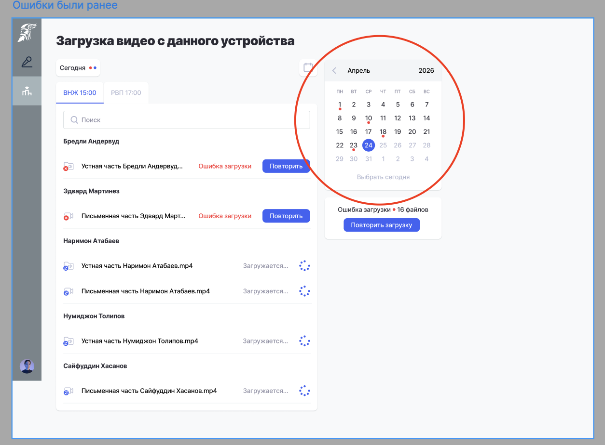

## **Подгрузка ошибочных записей через приложение**

Шаг 1. Определить ПК, где запись не передалась. Сделать это можно по «красной точке» рядом с пунктом меню, если такая точка есть, значит, есть проблема с передачей записи.

{width=1466px height=820px}

Шаг 2. Войти на ПК, откуда не передалась запись.  Нажать на календарь

{width=972px height=596px}

Шаг 3. Кликнуть по дате, отмеченной красной точкой и повторить отправку.

{width=1254px height=924px}