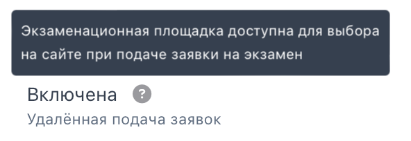

Для площадок добавлена возможность подключения удаленного приема заявок с сайта <https://www.migrant-exam.ru/>.

Включение и выключение этого флага реализовано на странице экзаменационной площадки, сделать это могут только администраторы платформы Flow.

{width=592px height=204px}

:::info 

Cдающий не сможет на сайте <https://www.migrant-exam.ru/> выбрать площадку, у которой удаленная подача заявок выключена, или архивную площадку.

:::

Отправить запрос на подключение/отключение необходимо [через форму](https://forms.yandex.ru/cloud/662cbe9243f74fea695ffa27/).