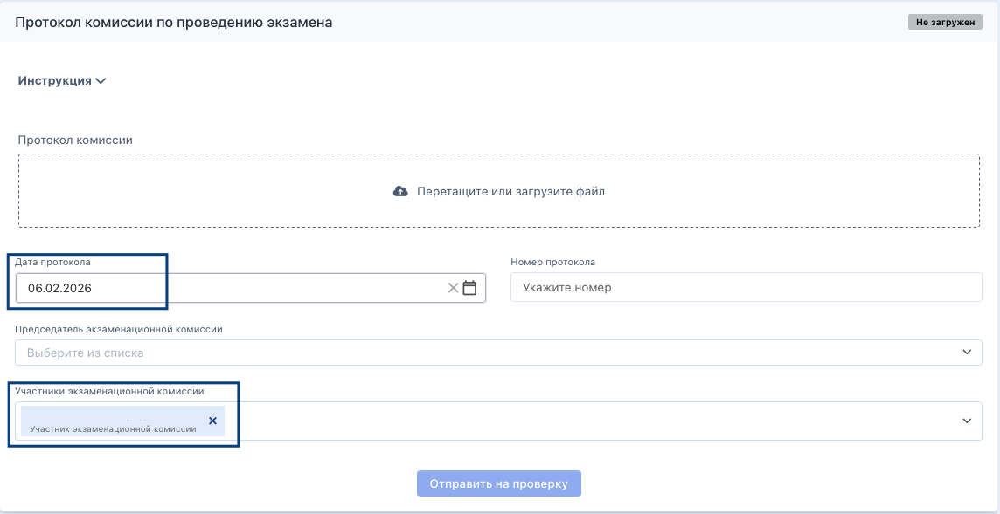

{width=1144px height=589px}

При создании/редактировании экзамена в Odin из Flow подтягивается перечень возможных экзаменаторов и председателей (их ФИО). 

 

Переданные ФИО экзаменаторов и председателя отображаются на странице экзамена во Flow предзаполненными в блоке "Протокол" с возможностью отредактировать. Также в блоке "Протокол" во Flow предзаполнена дата протокола  с возможностью редактирования.

