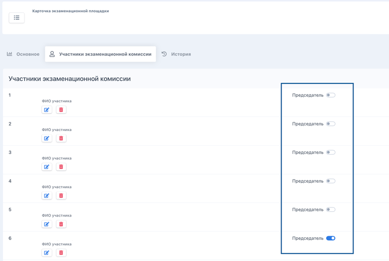
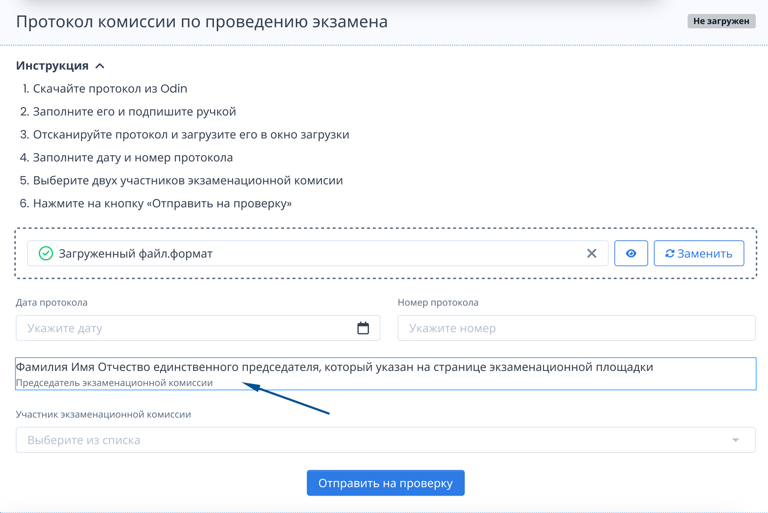
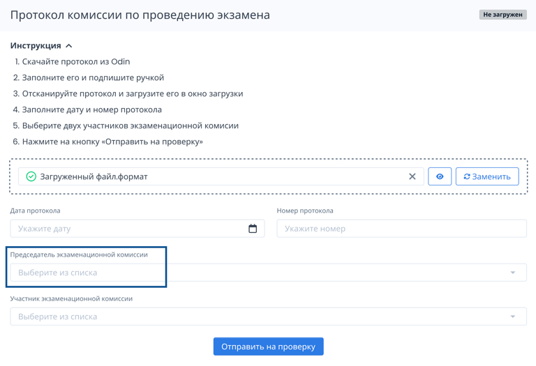
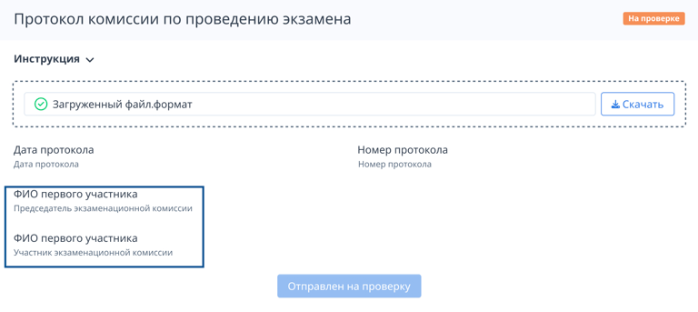

На странице экзаменационной площадки можно выбрать несколько председателей комиссии.

{width=768px height=516px}

У разных экзаменов могут быть разные председатели комиссии и более двух подписывающих. В связи с этим реализована следующая логика:

-  если у экзаменационной площадки указан только один председатель комиссии, то он будет отображаться по умолчанию у протокола на странице экзамена.

   {width=768px height=513px}

-  если у площадки несколько председателей комиссии, то будет доступен выбор председателя комиссии из числа указанных на странице площадки.

   {width=768px height=525px}

Еще есть возможность добавлять количество участников экзаменационной комиссии и отображать всех выбранных участников протокола с названием его роли.

{width=768px height=343px}

Посмотреть информацию о членах комиссии можно на странице экзамена в блоке с протоколом.