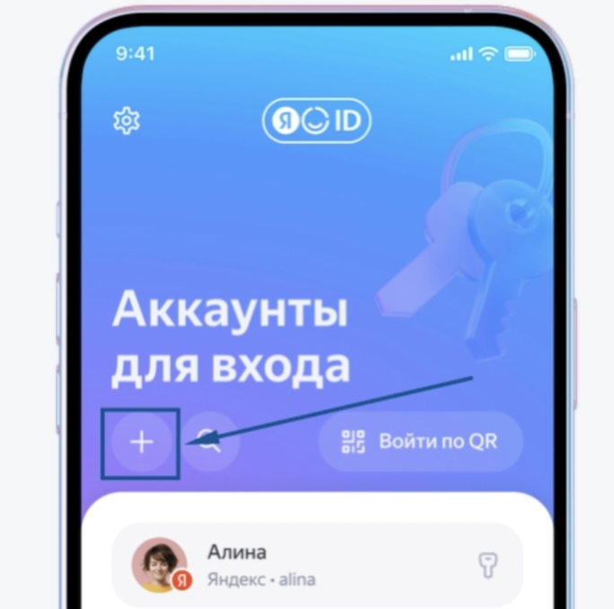

## Для двойной защиты аккаунтов в системе установлена авторизация через Яндекс.Ключ

1\.Скачайте приложение Яндекс.Ключ на ваш смартфон, авторизируйтесь в приложении.

Ссылка для скачивания [RuStore](https://www.rustore.ru/catalog/app/ru.yandex.key)

Ссылка для скачивания [Google Play](https://play.google.com/store/apps/details?id=ru.yandex.key) (Минимальная версия Android: Android 6.0. Рекомендуемая версия: Android 10+)

Ссылка для скачивания [App Store](https://apps.apple.com/ru/app/яндекс-ключ-ваши-пароли/id957324816) (Минимальная версия: iOS 15.0 или новее)

2\. Перейдите на [страницу авторизации](https://flow.migrant-exam.ru/Account/Login1FA). Если авторизированы, то необходимо выйти.

3\.Введите логин и пароль от FLOW.

4\.Если учетная запись ещё не привязана к Яндекс.Ключ, то отобразится QR код.

{width=1276px height=664px}

5\.Откройте Яндекс.Ключ на телефоне и нажмите знак «+», чтобы добавить новый аккаунт. (НЕ выбирайте "Войти через QR).

{width=684px height=678px}

6\.Нажмите "Сканировать QR" и наведите камеру на QR-код, отображенный в браузере.

{width=1004px height=1550px}

7\.Для завершения настройки введите код, созданный Яндекс.Ключ, в поле "Код подтверждения" во Flow.

{width=858px height=1214px}