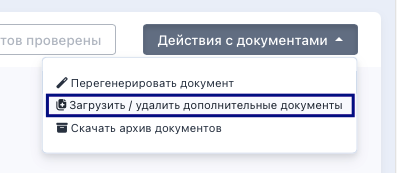
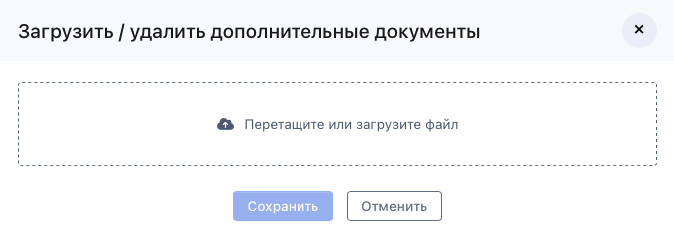

Иногда необходимо загрузить дополнительный документ в заявку, например, чек об оплате экзамена. 

Такая возможность загружать дополнительный документ есть на странице заявки и доступна пользователям с ролями "Сотрудник центра тестирования" и "Сотрудник экзаменационной площадки", "Администратор». Сам сдающий загрузить дополнительные документы не может.

Загрузка осуществляется на странице заявки в блоке "Сканы документов" в "Действия с документами" -"Загрузить/удалить дополнительный документ». 

{width=397px height=173px}

При клике  открывается модальное окно для загрузки/удаления, замены дополнительного документа.

{width=674px height=239px}

Можно добавить один или несколько файлов.