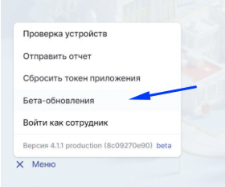
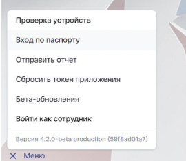
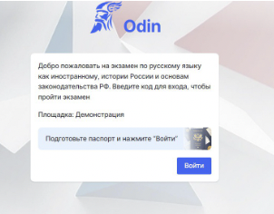

Шаг 1. Войти в меню приложения и включить бета версию. **Версия должна стать 4.2.2** с припиской beta

(Тут могут потребоваться разрешения администратора на компьютере)

{width=280px height=232px}

Шаг 2. Включить в меню пункт “Вход по паспорту”

{width=270px height=234px}

Шаг 3. Нажать на кнопку “Войти” после того, как паспорт человека, сдающего экзамен будет подготовлен.

{width=302px height=236px}

Шаг 4. Показать паспорт в на камеру.

Важно, чтобы при демонстрации паспорта не было бликов и выделенная область попадала в экран и зафиксировалась в зелёной рамке

{width=434px height=304px}

-  Если удается распознать данные паспорта и определить экзаменуемого, то открывается страница, как  если бы ввел корректный код = человек может начать экзамен

-  Если не удается распознать данные, то рамка подсветится красным - экзаменатору следует нажать кнопку “Назад”, в меню выбрать пункт “Войти по коду” и выдать человеку код для входа в экзамен, как делали ранее

