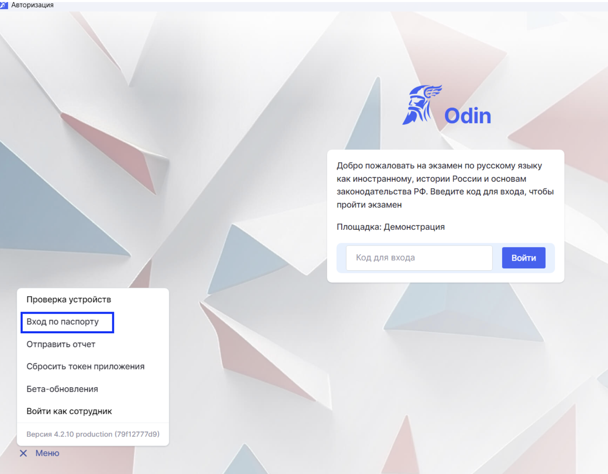
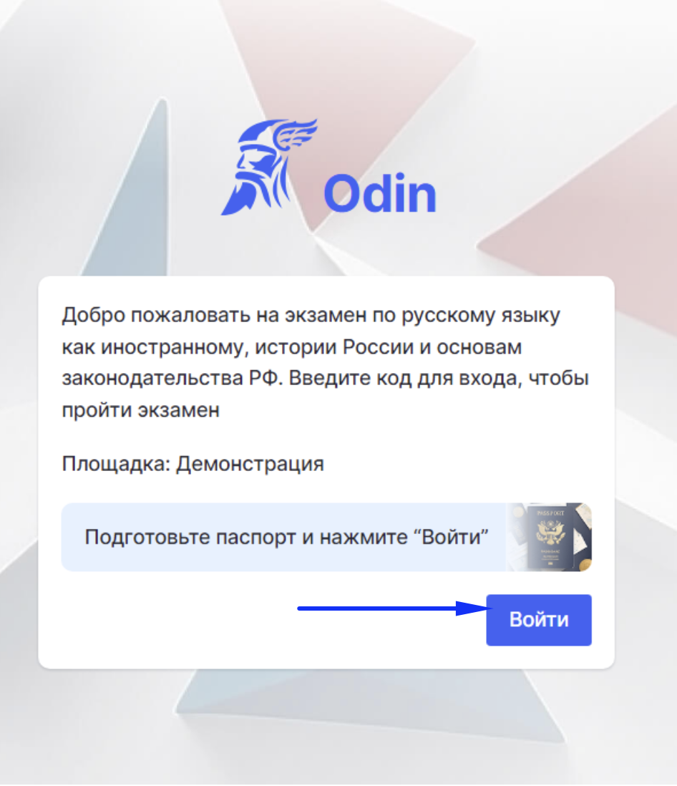
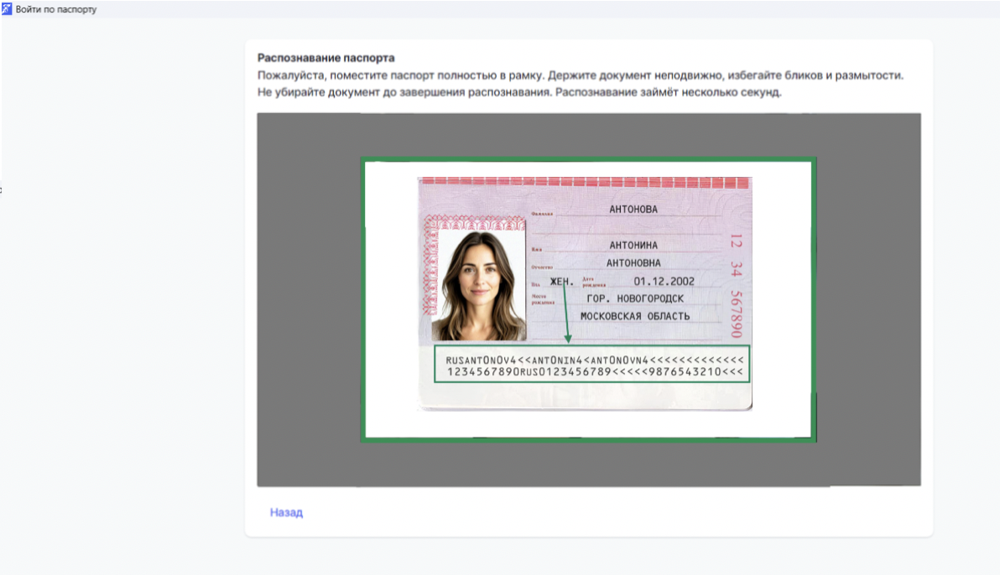
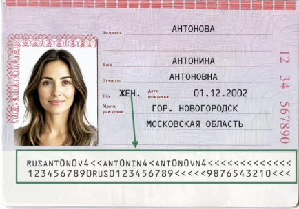

**Шаг 1.** Включить в меню пункт “Вход по паспорту”

{width=1766px height=1378px}

**Шаг 2.** Нажать на кнопку “Войти” после того, как паспорт человека, сдающего экзамен будет подготовлен.

{width=946px height=1098px}

Шаг 4. Показать паспорт на камеру.

{width=1192px height=686px}

:::info 

Важно, чтобы при демонстрации паспорта не было бликов и выделенная область попадала в экран и зафиксировалась в зелёной рамке

{width=434px height=304px}

:::

-  Если удается распознать данные паспорта и определить экзаменуемого, то открывается страница, как  если бы введен корректный код = человек может начать экзамен

-  Если не удается распознать данные, то рамка подсветится красным - экзаменатору следует нажать кнопку “Назад”, в меню выбрать пункт “Войти по коду” и выдать человеку код для входа в экзамен, как делали ранее