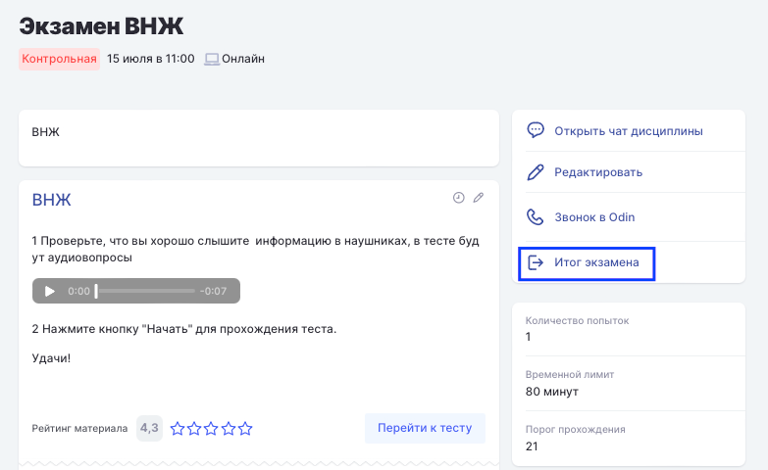
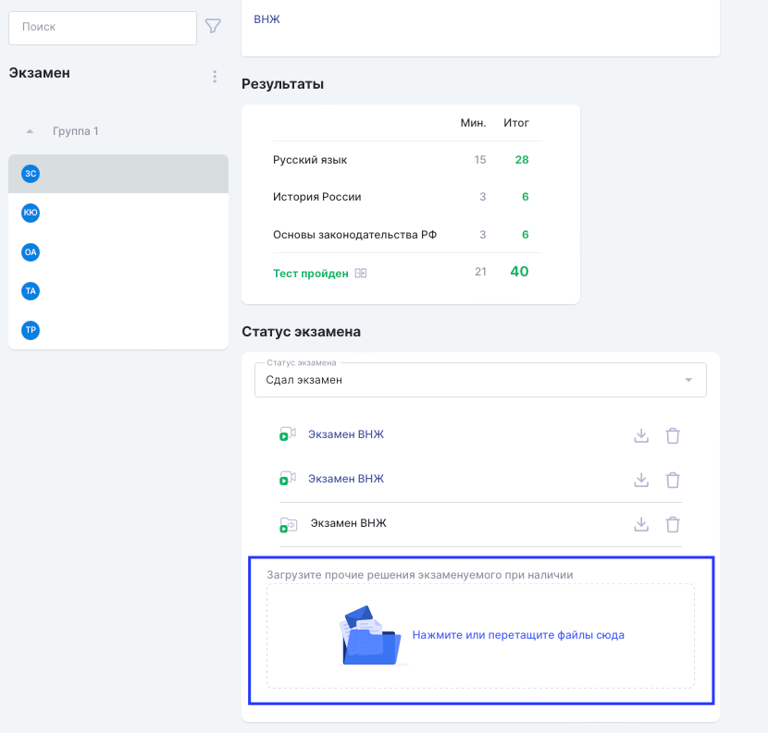

При проведении экзамена через приложение Odin, случаются ситуации, когда запись может не загрузиться автоматически в Odin.

Но всегда это можно сделать вручную. Файлы с видео сохраняются на компьютере, обычно это каталог пользователя на системном диске  (`C:\\Users\{UserName}\Odin\records).`

Далее следует зайти на страницу итогов экзамена.

{width=768px height=470px}

После надо загрузить файл соответствующему сдающему через дропзону.

{width=768px height=733px}