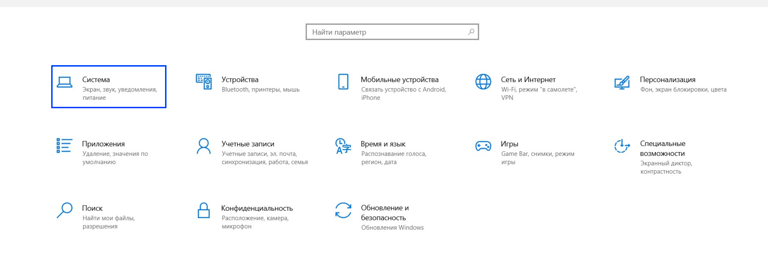

В ОС Windows можно выставить фиксированную настройку по масштабу. Для компьютеров на площадках, где необходимо установить увеличение масштаба на постоянной основе.  Для этого

1. Зайдите в настройки системы

   {width=768px height=264px}

2. В выпадающем списке "Масштаб и разметка" выберите требуемый масштаб

.png>)

---

Данный масштаб будет применён ко всем страницам и приложениям на компьютере.